# AJO Content MCP Server

A production-grade **Model Context Protocol (MCP) server** that connects LLM-powered clients to Adobe Journey Optimizer. AI agents can manage the full content lifecycle — creating, retrieving, updating, deleting, publishing, and archiving **content templates** and **content fragments** — as well as organize content into **folders** and classify it with **tags**, look up real personalization attribute paths through the **XDM Schema Registry**, generate AJO Visual Designer compatible email HTML and personalization expressions using built-in **authoring references**, and optionally mirror every content change to a **GitHub repository** for version history or human-approval workflows. All of this through natural language.

---

## Table of Contents

1. [Overview](#overview)
2. [Features](#features)
3. [Example Prompts](#example-prompts)
4. [Prerequisites](#prerequisites)
5. [Run](#run)
6. [MCP Server Configuration](#mcp-server-configuration)
7. [GitHub Integration (optional)](#github-integration-optional)
8. [Cross-Sandbox Promotion](#cross-sandbox-promotion-promote_assets)
9. [Client Connection Guide](#client-connection-guide)
10. [AEM Assets in AJO Content (optional)](#aem-assets-in-ajo-content-optional)
11. [Available Tools — Detailed](#available-tools--detailed)
12. [MCP Resources](#mcp-resources)
13. [MCP Prompts](#mcp-prompts)
14. [Observability](#observability)
15. [Security](#security)
16. [Development](#development)
17. [Troubleshooting](#troubleshooting)
18. [Architecture](#architecture)
19. [License](#license)

---

## Overview

This MCP server bridges LLM clients (Claude, Cursor, Codex) with the Adobe Journey Optimizer Content Management REST API. It exposes 49 tools covering the full template and fragment lifecycle, folder and tag organization (the Unified Tags/Folders API), read-only Experience Platform Schema Registry (XDM) lookups, cross-sandbox content promotion (dev → prod) and same-sandbox repo→live deploy, a server-context lookup, and read-only AJO authoring references (the Visual Email Designer HTML spec, the personalization syntax library, and an email-authoring scenario FAQ), handles Adobe IMS authentication with token caching, and ships with enterprise-grade observability, security, and reliability features.

The Schema Registry tools let the LLM discover the **real personalization attribute paths** configured in a sandbox — most customers define custom field groups under their tenant namespace rather than using only default XDM fields — so generated content references attributes that actually exist instead of guessing `{{_yourtenant.profile.person.firstName}}`. Complementing them, the **authoring reference** tools teach the LLM the exact output formats AJO expects: `get_visual_designer_requirements` returns the native HTML serialization spec so generated email stays editable in the drag-and-drop designer, and `get_personalization_syntax` returns AJO's native personalization expression language (helper functions, conditionals, loops, dataset lookup) so expressions use real AJO constructs rather than generic Handlebars/Liquid.

---

## Features

### Content Templates
| Tool | Description |
|------|-------------|
| `list_content_templates` | Paginated listing with filtering and sorting |
| `create_content_template` | Create email, push, SMS, in-app, code, direct mail, and landing page templates |
| `get_content_template` | Fetch a single template by ID (returns etag for updates) |
| `update_content_template` | Full replacement (PUT) with optimistic locking |
| `patch_content_template` | Partial update via JSON Patch (RFC 6902) |
| `delete_content_template` | Permanent deletion |

### Content Fragments
| Tool | Description |
|------|-------------|
| `list_content_fragments` | Paginated listing with status and type filtering |
| `create_content_fragment` | Create HTML or expression fragments |
| `get_content_fragment` | Fetch a fragment by ID (returns etag) |
| `update_content_fragment` | Full replacement (PUT) |
| `patch_content_fragment` | Partial update via JSON Patch |
| `publish_content_fragment` | Publish/freeze fragment (async) |
| `get_live_fragment` | Get content from last successful publication |
| `get_fragment_publication_status` | Poll publication progress |
| `archive_content_fragment` | Archive a fragment (fragments cannot be deleted via the API) |

### Folders (organization)
Organize content into a navigable tree (Unified Folders API). A folder is addressed by both a `folderType` (the object family it holds) and a `folderId`; file content into one via `parentFolderId` on the create/patch content tools. Requires the Unified Tags/Folders API on the credential's Developer Console project.
| Tool | Description |
|------|-------------|
| `create_folder` | Create a top-level or nested folder *(write)* |
| `get_folder` | Fetch a single folder by folderType + folderId |
| `update_folder` | Rename a folder (only the name is patchable) *(write)* |
| `delete_folder` | Delete a folder — irreversible *(write, destructive)* |
| `list_subfolders` | List a folder's children to walk the tree |
| `validate_folder` | Check whether a folder is eligible to hold objects |
| `ensure_folder_path` | Idempotently create a multi-level folder path, reusing existing levels *(write)* |

### Tags & tag categories (organization)
Classify content for discovery (Unified Tags API). A tag belongs to exactly one category (`Uncategorized` if unspecified). Requires the Unified Tags/Folders API on the credential's Developer Console project. **Tag categories are read-only here** — creating/updating/deleting them requires system/product administrator privileges the typical MCP principal lacks, so those operations are intentionally not exposed; create tags in `Uncategorized` (omit `tagCategoryId`) for the non-admin path.
| Tool | Description |
|------|-------------|
| `list_tag_categories` | List tag categories (sort/filter) |
| `get_tag_category` | Fetch a tag category by ID |
| `list_tags` | List/filter tags (e.g. by `tagCategoryId`) |
| `create_tag` | Create a tag, optionally in a category *(write)* |
| `get_tag` | Fetch a tag by ID |
| `update_tag` | Rename, archive/unarchive, or move a tag *(write)* |
| `delete_tag` | Delete a tag — irreversible *(write, destructive)* |
| `validate_tags` | Validate a set of tag IDs (valid/invalid split) |

### Schema Registry (XDM) — read-only
For discovering real personalization attribute paths. Requires the AEP Schema Registry API on the credential's Developer Console project.
| Tool | Description |
|------|-------------|
| `list_xdm_schemas` | List XDM schemas (tenant or global container) |
| `get_xdm_schema` | Retrieve a schema, fully resolved by default (all field groups inlined) |
| `list_xdm_field_groups` | List field groups — where custom attributes are defined |
| `get_xdm_field_group` | Retrieve a field group, fully resolved by default |
| `list_xdm_union_schemas` | List union schemas (merged per-class view, e.g. the full Profile) |
| `get_xdm_union_schema` | Retrieve a union schema — the complete attribute set for personalization |

### Authoring References — read-only
Reference content the LLM fetches to produce output in the exact format AJO expects. Delivered as tools (not just resources) so they work in clients that can't read MCP resources directly (e.g. Claude Desktop).
| Tool | Description |
|------|-------------|
| `get_visual_designer_requirements` | The complete native-HTML serialization spec for the AJO Visual Email Designer (rules, structure/component catalog, required `<head>`). Call before authoring email HTML so it stays in drag-and-drop mode. |
| `get_personalization_syntax` | The AJO-native personalization syntax library (expression language, helper functions, operators, contextual-data iteration, dataset lookup). Served one category at a time. Call before writing `{{ }}` / `` expressions. |
| `get_personalization_guidance` | AJO personalization strategy guide — when and what to personalize (discovery process, data-source resolution, iteration rules, coverage checklist). Call before authoring any dynamic content. |
| `get_email_scenario_faq` | Triage/conversation playbook for authoring AJO email — maps the common email personalization scenarios (structure, global vars, reusable header/footer fragments, product feeds, sorting/eligibility, price/text transforms, tracking/deep links, images, conditional content, compliance) to their AJO solution and, for each, the clarifying questions to ask. Call first when creating a new AJO email or converting a provided HTML email. |

### AEM Assets — read-only
| Tool | Description |
|------|-------------|
| `get_aem_image_embed_instructions` | Returns the step-by-step procedure for resolving the three AJO media-library embed attributes (`data-medialibrary-id`, `data-mediarepo-id`, `data-medialibrary-source`) of an AEM DAM image. Call before embedding any AEM-hosted image into content. |

### Server Context — read-only
| Tool | Description |
|------|-------------|
| `get_server_context` | Reports who/what the server is acting as (author, sandbox, tenant, org, write-access) plus the full grouped tool catalog. |
| `get_naming_convention` | Returns the administrator-defined naming convention enforced when creating or renaming templates, fragments, folders, and tags. Call before assigning any name. |

### GitHub Integration — optional
When a GitHub repository is configured (see [GitHub Integration](#github-integration-optional)), two additional tools are exposed.
| Tool | Description |
|------|-------------|
| `check_pr_status` | Check whether a GitHub pull request is open, merged, or closed, and get its merge commit SHA. |
| `deploy_merged_changes` | Read the payload from a merged PR and re-execute the AJO write operations it describes, applying approved changes to AJO. |

### Cross-Sandbox Promotion & Repo Deploy
Push committed repo content into AJO. **Cross-sandbox** (dev → prod) uses the phased, PR-gated promotion tools; **same-sandbox** (deploy a subtree into its own live sandbox) uses the direct deploy tools. See [Cross-Sandbox Promotion](#cross-sandbox-promotion-promote_assets) and [Same-Sandbox Repo Deploy](#same-sandbox-repo-deploy-deploy_repo_assets) for the workflows.
| Tool | Description |
|------|-------------|
| `plan_promotion` | *(read-only)* Build a cross-sandbox promotion plan: the full dependency closure, phase order, per-asset folder/embed info, and whether each asset already exists in the target. Writes nothing. |
| `promote_assets` | Promote fragments/templates into the **active** target sandbox — `targetSandbox` must be the sandbox currently selected in the UI (reselect it first; promotion can only write to the active sandbox, like every other tool), reading from a different source subtree (e.g. dev) in the repo. Re-resolves every environment-local UUID (embeds, folders, tags, self-references) by name/path. Phased + resumable; runs through the PR approval gate. |
| `list_repo_assets` | *(read-only)* Enumerate the content fragments, templates, **and tags** committed under a sandbox's repo subtree (each item is typed `fragment` / `template` / `tag`). Use it to preview what exists in the repo or resolve names for a deploy. |
| `deploy_repo_assets` | Deploy a repo subtree's already-merged content into the **same-named active** sandbox (repo → live). Direct write, idempotent (dedup by name), dependency-ordered. |

---

## Example Prompts

Once your LLM client is connected to this MCP server, you can talk to it in plain language. Below are ready-to-use prompts organised by what you're trying to do — copy them directly or use them as inspiration.

---

### 🧭 Orientation — start here

Before doing any real work, confirm *what* you're connected to and *what you can do*. These are the prompts to run first.

**Which server / tenant / sandbox am I on, and who am I acting as?**
> "Call get_server_context and tell me who this server is acting on behalf of, which sandbox and tenant it's on, and whether write access is enabled."

> "Before we start, confirm the Adobe Journey Optimizer environment: author email, tenant namespace, and sandbox name."

> "List one content template and tell me the org, tenant, sandbox, and author it came from." *(Every tool result is prefixed with `[tenant: … | sandbox: … | author: …]` — plus `org: …` if an org name was supplied during setup — so this is the most reliable way to see the exact target. The `get_server_context` tool returns the same details on demand, without performing any content operation.)*

**What can I do right now (read-only vs read-write)?**
> "Are you currently allowed to create or modify content through the ajo-content server, or is it read-only?"

> "Try to tell me whether write access is enabled. If it isn't, what do I need to do to turn it on?" *(If writes are off, write attempts return a `READ_ONLY_MODE` error pointing you to `http://localhost:3000`.)*

**What tools are available?**
> "Call get_server_context and list every tool this server exposes, grouped by domain." *(`get_server_context` returns the full tool catalog, so this works even if some tools didn't surface in an initial search.)*

> "What AJO content tools do you have access to? Group them into read vs. write operations."

> "Summarize what each ajo-content tool does, so I know what I can ask for."

---

### 🔍 Browsing & Discovery

**List everything**
> "Show me all the content templates in this sandbox."

> "List all content fragments, sorted by most recently modified."

> "How many content templates do we have? Give me a summary grouped by channel."

**Search and filter**
> "Find all email templates whose name starts with 'Cyber Monday'."

> "Show me all push notification templates created in the last 30 days."

> "List all content fragments that are currently in DRAFT status."

> "Find all fragments of type 'expression' on the shared channel."

> "Are there any templates that came from AEM? List them."

**Inspect a specific item**
> "Get the full details of template ID b6d70a45-a149-453b-85ba-809a5d40066d."

> "Show me the HTML content inside the 'Welcome Email' template."

> "Fetch fragment b6d70a45-a149-453b-85ba-809a5d40066d and tell me what channel it targets and what its current status is."

---

### 🧬 Personalization — use real attribute paths

These use the Schema Registry (XDM) tools to find the attributes that actually exist in your sandbox, so content references real paths instead of generic guesses. (Requires the AEP Schema Registry API on your Developer Console project.)

> "What custom field groups are defined in this sandbox? List them."

> "Show me the full Profile union schema and list the personalization attributes available, with their paths."

> "Find the loyalty-related attributes in our XDM schemas and tell me the exact paths I'd use for personalization."

> "Create a welcome email fragment, but first look up our actual profile attributes and use the real first-name and loyalty-tier paths instead of the default XDM ones."

> "Before personalizing this template, check our tenant field groups and map each placeholder I want (first name, city, points balance) to its real attribute path."

> "Show me the AJO personalization syntax for a loyalty-points expiry countdown with a fallback — use get_personalization_syntax, don't improvise Handlebars."

> "Build a conditional block that greets Gold-tier members differently from everyone else, using real AJO operator and if/else syntax."

---

### ✏️ Creating Content

**Templates**
> "Create an HTML email template called 'Summer Sale Header' with this HTML: `<div>Hi {{profile.person.name}}, our summer sale is live!</div>`"

> "Create a push notification template called 'Flash Sale Alert' with the title 'Limited time offer 🔥' and message 'Tap to see deals ending in 2 hours.'"

> "Create an SMS template called 'Order Shipped' with the text 'Hi {{profile.person.name}}, your order {{order.id}} has shipped and will arrive by {{order.estimatedDelivery}}.'"

> "Create a new in-app message template called 'Loyalty Milestone' with an HTML body that congratulates the user on reaching Gold status."

> "Create a direct mail template called 'Holiday Catalog 2025' with a fileName of 'holiday-catalog' and include fields for first name, last name, and postal address."

> "Create a code-based template called 'Hero Banner JSON' on the code channel with subType JSON."

**Fragments**
> "Create an HTML fragment called 'Global Footer' with this content: `<footer>© 2025 Acme Corp | <a href='/unsubscribe'>Unsubscribe</a></footer>`. It should target the email channel."

> "Create an expression fragment called 'Personalised Greeting' with the expression `Hello {{profile.person.firstName}}, welcome back!` on the shared channel."

> "Create a new draft HTML fragment called 'Promo Banner' for the email channel. The content should be a red banner div with the text 'Up to 50% off selected items'."

---

### 🔄 Updating Content

**Rename or re-describe**
> "Rename template b6d70a45-... to 'Black Friday Email — v2'."

> "Update the description of fragment b6d70a45-... to 'Used in all promotional campaigns Q4 2025'."

> "Move template b6d70a45-... into folder a49dbe03-..."

**Edit content**
> "Update the 'Welcome Email' template. Keep everything the same but change the HTML to include a new hero image tag: ``."

> "The 'Order Shipped' SMS template needs updating. Change the text to also include a tracking URL: `Track here: {{order.trackingUrl}}`."

> "I need to update fragment b6d70a45-... — fetch it first, then replace its HTML content with `<div class='banner'>New Year Sale — 40% off everything!</div>`."

---

### 🚀 Publishing Fragments

> "Publish fragment b6d70a45-... so it's ready to use in campaigns."

> "Publish the 'Global Footer' fragment and then check whether the publication succeeded."

> "What is the publication status of fragment b6d70a45-...? Is it live yet?"

> "Publish fragment b6d70a45-... and keep checking the status every few seconds until it's complete, then confirm it's live."

> "Show me the live published content of fragment b6d70a45-... — what HTML is actually being served to campaigns right now?"

---

### 🗑️ Deleting & Archiving Content

> "Delete template b6d70a45-a149-453b-85ba-809a5d40066d."

> "I need to clean up. List all templates with 'test' or 'draft' in the name, then delete them."

> "Delete all email templates that haven't been modified since January 2024." *(The LLM will list first and confirm before deleting.)*

> "Archive fragment b6d70a45-... — I no longer need it in the active library."

> "Archive all fragments that are still in DRAFT status and haven't been modified since January 2024."

---

### 🔁 Multi-Step Workflows

These prompts ask the LLM to chain multiple tools together autonomously.

> "Create a complete email template called 'Abandoned Cart' with a subject of 'You left something behind…' and HTML body reminding the user of their cart items using `{{cart.items}}`. Then show me the ID so I can reference it."

> "I want to set up a reusable unsubscribe footer fragment. Create an HTML fragment called 'Unsubscribe Footer' for the email channel, publish it, and confirm it's live."

> "Clone the template at ID b6d70a45-... — fetch its full content, create a new template with the same content but named 'Copy of [original name]', and return the new ID."

> "Audit our fragment library: list all fragments, identify which ones are still in DRAFT status, and give me a summary of how many are PUBLISHED vs DRAFT vs PUBLISHING."

> "We're doing a Q4 cleanup. List all templates that have 'summer' in the name and delete each one. Walk me through what you're deleting before you do it."

> "Create three SMS templates for an onboarding sequence: 'Onboarding Day 1', 'Onboarding Day 3', and 'Onboarding Day 7'. Each should have personalised text referencing `{{profile.person.firstName}}` and a relevant message for that day of onboarding."

---

### 💡 Tips for Best Results

**Be specific about IDs when you have them.** If you know the template or fragment ID, include it — the LLM won't need to search first.

> ✅ "Get template b6d70a45-a149-453b-85ba-809a5d40066d"
> vs.
> ⚠️ "Get my welcome email template" *(requires a search step)*

**Mention the channel when creating.** The API requires exactly one channel per template or fragment.

> ✅ "Create an email template called…"
> ✅ "Create a push notification template called…"

**For updates, you don't need to fetch the etag yourself.** Just ask the LLM to update something — it will automatically fetch the current version and etag before making the change.

> ✅ "Update the description of template b6d70a45-... to 'New description'"

**Publishing is async.** After asking to publish a fragment, the LLM can poll `get_fragment_publication_status` for you — just ask it to confirm when publication is complete.

> ✅ "Publish fragment b6d70a45-... and tell me when it's done."

**Pagination is handled automatically.** If you ask to list all templates, the LLM can page through results on your behalf.

> ✅ "List all templates in this sandbox, even if there are more than 20."

---

## Prerequisites

Two things before you start:

1. **Adobe API credentials**, packaged as an environment file — this is what you upload in [Configuration](#mcp-server-configuration) Step 1 (Credentials), so set it up first.
2. **Docker Desktop**, to build and run the server. Dependencies are installed and the code is compiled inside the container, so you don't need Node.js installed on your machine.

The steps are the same whether you're on **macOS** or **Windows**.

### 1. Adobe API credentials (the environment file)

This step produces the environment file that [Configuration](#mcp-server-configuration) Step 1 (Credentials) expects. You set up the credentials in two places — the **Adobe Developer Console** (the API project) and **Adobe Journey Optimizer** (the matching user role) — and you do it **twice**, once for the non-production environments and once for an all-environments (including prod) set.

> **You need admin access to both** the Adobe Developer Console and the AJO platform to complete this step. If you don't have it, ask your Adobe org administrator to either grant it or perform these steps for you.

#### a. Create the API project (Adobe Developer Console)

<a href="readme_images/create_api_project_step1.png">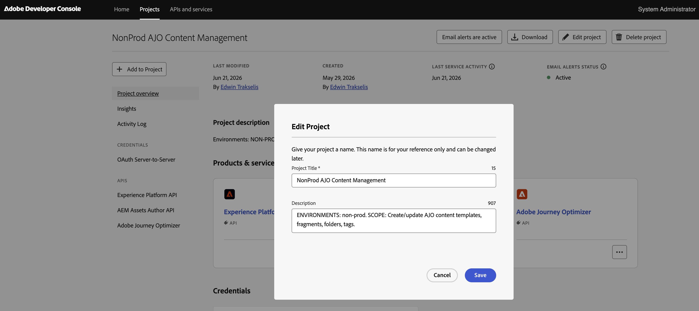</a>

In the [Adobe Developer Console](https://developer.adobe.com/console), create a new API project. Give it a **name** and **description** that clearly communicate (1) that the project is for **non-production** environments and (2) its **scope** — reading, creating, updating, and deleting AJO content templates, fragments, tags, and folders. The name and description are reference-only, so make them descriptive enough that anyone can tell what the project is for at a glance.

#### b. Add the two API services

<a href="readme_images/create_api_project_step2.png">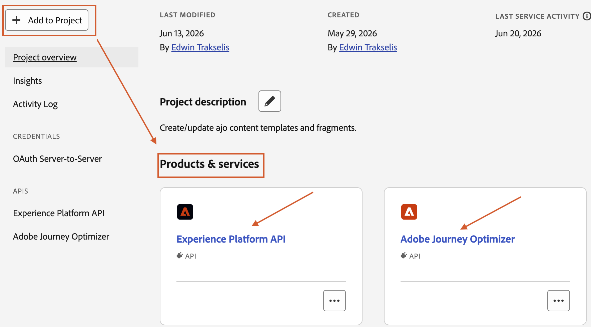</a>

Use **Add to Project → API** to add **two** services to the project: **Experience Platform API** and **Adobe Journey Optimizer**. Both should appear under **Products & services** when you're done.

#### c. Name the credential to match the project

<a href="readme_images/create_api_project_step3.png">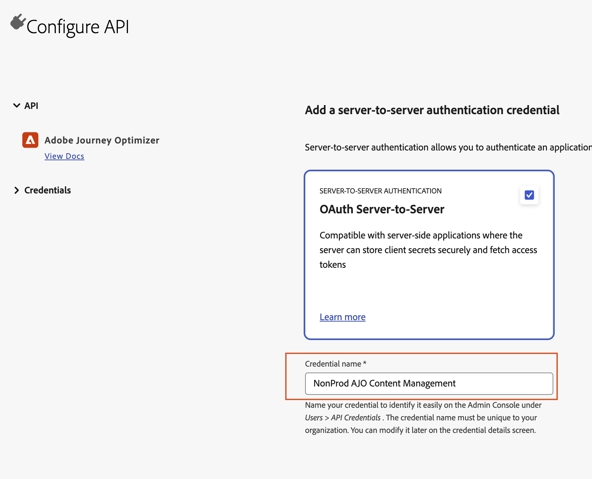</a>

When you add the Adobe Journey Optimizer service, choose **OAuth Server-to-Server** authentication and set the **Credential name** to **match the name of the API project** (e.g. `NonProd AJO Content Management`). Keeping the names aligned makes the credential easy to find later under **Users → API Credentials**.

#### d. Assign the product profile

<a href="readme_images/create_api_project_step4.png">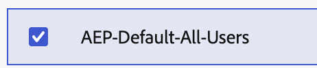</a>

When prompted to assign a product profile, select the default **AEP-Default-All-Users** profile.

#### e. Download the environment file

<a href="readme_images/create_api_project_step5.png">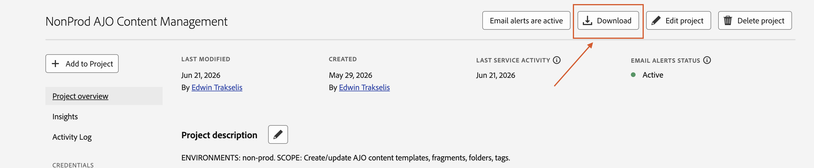</a>

From the project's overview page in the Developer Console, click the **Download** button at the top. This gives you the **Postman environment** JSON file — exactly what you upload in [Configuration](#mcp-server-configuration) Step 1 (Credentials).

> You only need this **single, project-wide** environment file — there's no need to download the Postman collection from each individual API service. Every service you added shares the project's one **OAuth Server-to-Server** credential, so the same environment file covers all of them.

Give the downloaded file a **meaningful name** so you can tell it apart from the other project's file later — e.g. label this one for the non-prod environments.

#### f. Create a second, all-environments project

Repeat steps **a–e** to create a **second** API project that is identical to the first, except that its **name and description** indicate it is intended for **all environments, including production**. The result is two projects: one scoped to the lower (non-prod) environments, and one that covers those same lower environments **and** production. Name its downloaded environment file accordingly (e.g. non-prod + prod) so the two files stay distinguishable.

#### g. Create the matching AJO user role

<a href="readme_images/create_api_ajo_role_step1.png">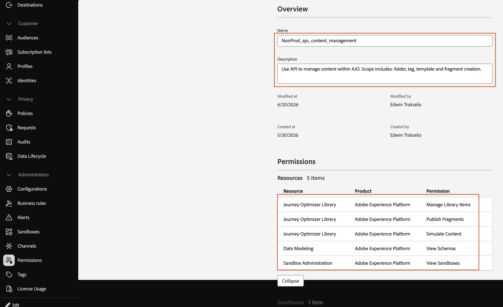</a>

In **Adobe Journey Optimizer → Permissions**, create a user **role** that mirrors the API project. As with the project, start by giving the role a **name** and **description** that indicate which environments it's scoped for and which API capabilities it grants — keep them aligned with the matching API project's name and description.

<a href="readme_images/create_api_ajo_role_step2.png">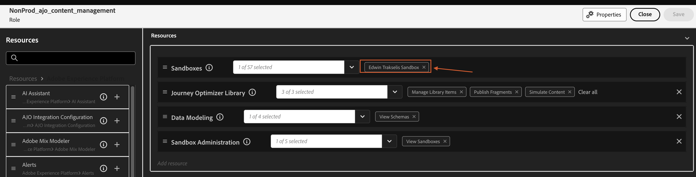</a>

Then **edit the role** to assign the appropriate **sandbox environment(s)** and the AJO permissions the server needs — for example, *Journey Optimizer Library* (Manage Library Items, Publish Fragments, Simulate Content), *Data Modeling* (View Schemas), and *Sandbox Administration* (View Sandboxes).

<a href="readme_images/create_api_ajo_role_step3.png">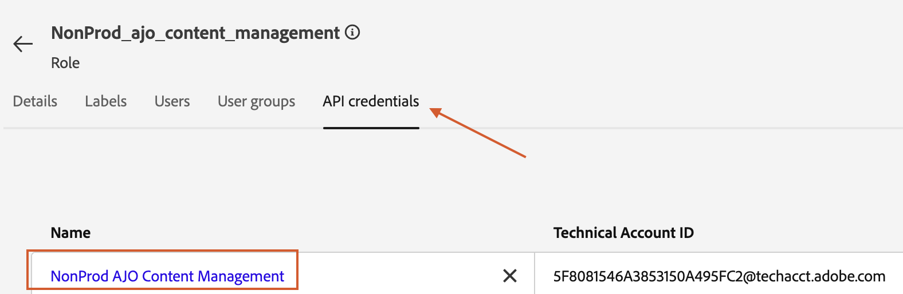</a>

Finally, on the role's **API credentials** tab, assign the API credential you created in steps b–c (the one whose name matches the project).

> Create a matching role for **each** of the two API projects (non-prod and all-environments).

### 2. Docker Desktop
- **Download:** [docker.com/products/docker-desktop](https://www.docker.com/products/docker-desktop/)
  - macOS: pick the **Apple Silicon** build for M1/M2/M3+ Macs, or the **Intel chip** build for older Macs.
  - Windows: download **Docker Desktop for Windows** (requires Windows 10/11 64-bit; WSL 2 is enabled by the installer).
- **After installing, launch Docker Desktop and wait until the whale icon shows "Docker Desktop is running."** The commands below will fail if the Docker engine isn't started.
- **Verify** in a terminal (macOS) or PowerShell (Windows):
  ```bash
  docker --version
  ```

> **Only contributing to the code?** To run the test suite or type-check outside Docker (see [Development](#development)), you'll also need [Node.js 18+ (LTS)](https://nodejs.org/en/download). It is **not** required just to build and run the server.

---

## Run

You don't need to clone the repo or build anything — a **pre-built, multi-architecture image** (Apple Silicon and Intel/AMD) is published to the GitHub Container Registry. You only need the `docker-compose.yml` file and Docker Desktop running.

**1. Get `docker-compose.yml`.** Either download it from this repo, or create a file with that name containing:

```yaml
services:
  ajo-content-mcp:
    image: ghcr.io/etrakselis/ajo-content-mcp:latest
    container_name: ajo-content-mcp
    ports:
      - "127.0.0.1:3000:3000"
    environment:
      - NODE_ENV=production
      - PORT=3000
      - HOST=0.0.0.0
      - LOG_LEVEL=info
      - AUDIT_LOG_PATH=/audit/audit-log.jsonl
      # - MCP_LEAN_MODE=1   # optional: collapse the 5 reference get_* tools into one get_reference tool (see note below)
    volumes:
      - ./audit:/audit
    restart: unless-stopped
    read_only: true
    tmpfs:
      - /tmp
    security_opt:
      - no-new-privileges:true
```

**2. Start it** from the folder that holds the file:

```bash
docker compose up -d
```

The first run **pulls** the image automatically (no `--build`); `-d` runs it detached so your terminal stays free. Docker picks the right build for your CPU architecture.

The setup UI is now available at **http://localhost:3000** — continue to [Configuration](#mcp-server-configuration).

> **Can't reach the page?** The server listens on the loopback interface only (it isn't exposed to your network by design). On systems where `localhost` resolves to IPv6 first, the browser normally falls back to IPv4 automatically — but if you hit a connection-refused error, use **http://127.0.0.1:3000** instead, or set `HOST=::1` in `docker-compose.yml` to bind the IPv6 loopback.

Common follow-up commands:

```bash
docker compose logs -f     # watch the server logs (Ctrl+C to stop watching)
docker compose pull        # fetch the latest published image
docker compose down        # stop and remove the container
docker compose up -d       # start it again later
```

> **Want to pin a version?** Replace `:latest` with a specific tag (e.g. `:1.0.0`) for reproducible deployments.

> **Optional — lean tool surface (`MCP_LEAN_MODE`).** By default the server advertises its full tool set, including five individual read-only reference tools: `get_visual_designer_requirements`, `get_aem_image_embed_instructions`, `get_personalization_guidance`, `get_personalization_syntax`, and `get_email_scenario_faq`. If you connect this server **alongside many other MCP servers** — where the client switches to deferred tool loading + semantic search and every advertised tool competes for the model's context budget — set `MCP_LEAN_MODE=1` (uncomment the line in `docker-compose.yml`, then `docker compose up -d`) to collapse those five into a single `get_reference` tool. Call it with a `topic`: `visual-designer`, `aem-image-embed`, `personalization-guidance`, `personalization-syntax` (also accepts a `category`), or `email-scenario-faq`. This trims the advertised tool count with **no loss of capability** — the reference content is byte-for-byte identical, and the original `get_*` tools remain callable by name so nothing that references them breaks. Leave it unset for the full, maximally-discoverable surface (the recommended default for a standalone connection). Accepted truthy values: `1`, `true`, `yes`, `on`.

> **Building from source instead?** Contributors can build the image locally rather than pulling it — see [Development](#development).

> **Sharing with someone who won't touch the repo?** The [`distribution/`](distribution/) folder is a self-contained bundle — an abridged `README.md` plus a ready-to-run `docker-compose.yml`. Zip it and hand it off; they only need Docker Desktop and their Adobe credentials file. See [Packaging the distribution bundle](#packaging-the-distribution-bundle).

---

## MCP Server Configuration

All setup happens in the browser UI at **http://localhost:3000** — navigate there and work through the steps below. The steps appear **one at a time**: only Step 1 is shown when the page loads, and each subsequent step is revealed automatically once you complete the one before it. A progress rail on the right labels the step you're on (`STEP 1 — CREDENTIALS`, `STEP 2 — SANDBOX`, …). Steps 1–3 are required; **Steps 4–6 are optional** — leave them at their defaults and continue to launch if you don't need them.

### Step 1 — Credentials

<a href="readme_images/mcp_server_step1.png">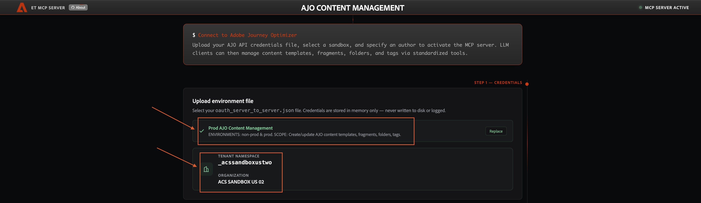</a>

Upload the environment file you created in [Prerequisites → 1. Adobe API credentials](#1-adobe-api-credentials-the-environment-file) (the `oauth_server_to_server.json` Postman environment). Drag and drop it, or click to browse.

As soon as the file loads, the server validates the credentials and the card confirms which file is active — its label, the environments it covers, and its scope (e.g. *"Prod AJO Content Management — ENVIRONMENTS: non-prod & prod. SCOPE: Create/update AJO content templates, fragments, folders, tags"*). Use **Replace** to swap in a different file. Directly below, a banner shows the **tenant namespace** and **organization** the server auto-detected from the credentials — confirm these match the tenant you intend to work in before continuing. In the background the server also discovers the sandboxes the credentials can access, which populates the dropdown in the next step.

> Credentials are stored **in memory only** — never written to disk, logged, or returned through any tool.

### Step 2 — Sandbox

<a href="readme_images/mcp_server_step2.png">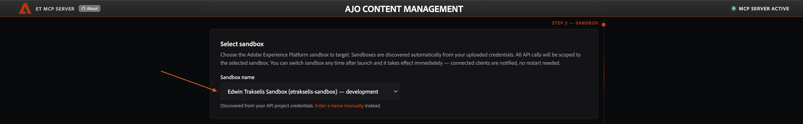</a>

Choose the Adobe Experience Platform **sandbox** to target. Every API call the server makes is scoped to this one sandbox. The dropdown is **populated automatically** from the sandboxes your uploaded credentials can access, so in most cases you just pick one — no typing required (each entry shows its display name, internal name, and type, e.g. *"Edwin Trakselis Sandbox (etrakselis-sandbox) — development"*). A selection is always required and nothing is pre-selected, even when only one sandbox is available.

If automatic discovery isn't possible — for example, the Sandbox Management API isn't enabled on your Developer Console project, or the credentials don't have permission to list sandboxes — use the **Enter a name manually** link to type the sandbox name yourself. You can switch between the dropdown and manual entry at any time using the links beneath the field.

You can find the sandbox name from the URL of your AJO instance — look for the parameter called `sname:`. Traditionally the sandboxes are named like `dev`, `staging`, or `prod`, but the exact name needs to be verified since they aren't enforced and can vary slightly between orgs.

You can **switch sandbox at any time after launch** and it takes effect immediately — connected clients are notified, no restart needed.

### Step 3 — Author

<a href="readme_images/mcp_server_step3.png">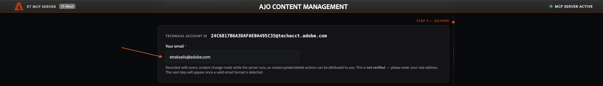</a>

Enter **your email address**. It's mandatory and is recorded with every content change made while the server runs, so create/update/delete/publish/archive actions can be attributed to a person (see [Audit log](#audit-log)). It is **not verified** — it's an honor-system field, so enter your real address. The next step is revealed once a valid email format is detected.

The read-only **Technical Account ID** shown above the field is the identity carried in your uploaded credentials (the machine account the API calls authenticate as) — the email you enter is the *human* attribution layered on top of it.

### Step 4 — Access mode (optional)

<a href="readme_images/mcp_server_step4.png">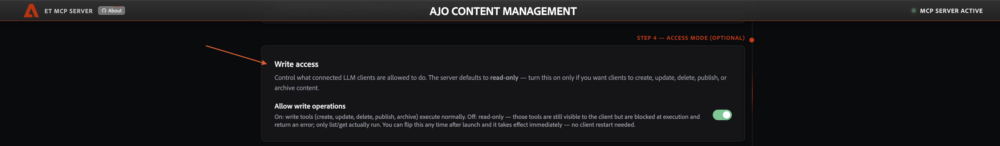</a>

Use the **Allow write operations** toggle to choose what connected LLM clients can do:

- **Off — read-only (default).** Only *list* and *get* operations run. Write tools (create, update, delete, publish, archive) stay visible to the client but are rejected at execution with a `READ_ONLY_MODE` error.
- **On — read & write.** Write tools execute normally.

Read-only is the safe default — leave it off unless you explicitly want clients to modify content. You can flip this **any time after launch** and it takes effect immediately — no client restart needed.

The full tool set is **always advertised** to clients regardless of this setting, and enforcement happens when a tool is *called*. This is deliberate: many clients (e.g. Claude Desktop) cache the tool list when they connect and don't react to a mid-session tool-list change, so hiding write tools would strand them in read-only even after you turned writes on. Instead, the server tells the LLM that writes are runtime-gated, so it attempts the operation when asked and surfaces the `READ_ONLY_MODE` error if it's currently off. Because of this, flipping the toggle **takes effect immediately with no client restart** — once you switch to On, the next write attempt simply succeeds.

#### Write confirmation

When write access is on, the server adds a second safety layer: before performing a write it asks you to confirm the target, naming the org, tenant namespace, and sandbox (and the author it's acting as). This uses the MCP [elicitation](https://modelcontextprotocol.io/specification/2025-06-18/client/elicitation) capability, so the confirmation is enforced by the server rather than left to the LLM to remember to ask.

- **Destructive writes** (`delete_content_template`, `archive_content_fragment`, `delete_folder`, `delete_tag`) are confirmed **every time** — there is no undo.
- **Other writes** (create, update, patch, publish) are confirmed **once per sandbox per session**, then remembered for the rest of that session.
- **Decline or dismiss** the prompt and the operation is **not performed** — the tool returns a `WRITE_CANCELLED` error and the LLM is instructed not to retry unless you ask again.
- Clients that **don't support elicitation** fall back to a **confirm-and-retry gate**: the first write is held with a `WRITE_CONFIRMATION_REQUIRED` error that instructs the LLM to confirm the target with you conversationally, then re-invoke the same tool with `confirmWrite: true`. The same destructive-vs-other cadence applies (destructive ops require the confirmation every time; other writes once per sandbox per session). The access-mode toggle is still enforced independently — this gate is about confirming the *target*, not granting write permission.
  - `confirmWrite: true` is a **universal escape hatch**, honored regardless of whether the client advertises elicitation. This matters for clients that advertise the `elicitation` capability but can't actually surface or answer the dialog (it silently declines): without the escape hatch, destructive ops — which re-confirm on *every* call and so can't be cleared by a cached confirmation — would be permanently blocked. With it, the LLM confirms the target with you and re-invokes with `confirmWrite: true` to proceed (the `WRITE_CANCELLED` message says exactly this).
  - `confirmWrite` is declared as an **optional boolean** on every write tool's input schema. It has to be advertised this way because strict clients (e.g. Claude Desktop) validate arguments against the schema and silently drop any property that isn't declared — so a flag the LLM tacked on without it being in the schema would never reach the server, and the gate could never be cleared. Leave it unset on the first call (that's what triggers the hold); the server strips it from the arguments before they reach the underlying AJO API.

##### Client support for elicitation

Elicitation is a newer part of the MCP spec ([2025-06-18](https://modelcontextprotocol.io/specification/2025-06-18/client/elicitation), with URL mode added in 2025-11-25) and client support is still uneven. A client must advertise the `elicitation` capability during the initialize handshake for the interactive prompt to appear; otherwise the server uses the confirm-and-retry fallback above. As of **2026-06-15**:

| Client | Elicitation prompt | Behavior here |
| --- | --- | --- |
| **Claude Code** (≥ 2.1.76, Mar 2026) | ✅ Supported | Interactive confirmation dialog |
| **Cursor** | ✅ Supported | Interactive confirmation dialog |
| **VS Code** (MCP) | ✅ Supported | Interactive confirmation dialog |
| **Claude Desktop** | ❌ Not yet | Confirm-and-retry gate |

> This is a moving target — support is expanding, so a client listed as unsupported today may gain the interactive prompt in a future release with no change needed here (the server already advertises and uses elicitation whenever the client offers it). Re-check your client's release notes if you expect the dialog and don't see it.

### Step 5 — Naming convention (optional)

<a href="readme_images/mcp_server_step5.png">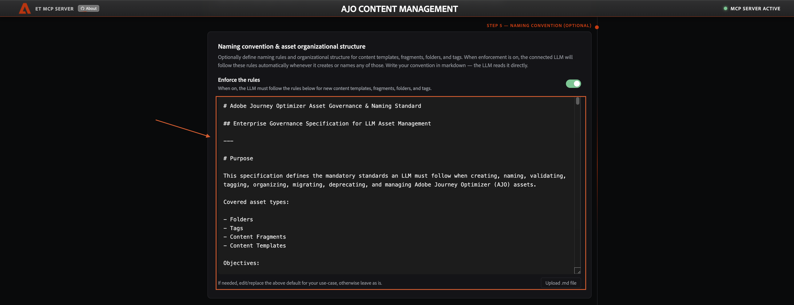</a>

Optionally define **naming rules and organizational structure** for content templates, fragments, folders, and tags. Write the convention in **markdown** — the connected LLM reads it directly and, when enforcement is on, follows it automatically whenever it creates or names any of those assets.

- **Enforce the rules** — the toggle that turns enforcement on or off. When on, the LLM must follow the rules below for all new templates, fragments, folders, and tags; it fetches them on demand through the `get_naming_convention` tool and is instructed to call that tool before assigning any name.
- The editor is pre-filled with a sensible **default governance standard** — edit or replace it inline for your use-case, or leave it as-is. Use **Upload .md file** to drop in an existing convention document instead of typing.

Whatever you enter here is exactly what the `get_naming_convention` tool returns to clients; if the LLM proposes a non-compliant name, it's told to explain the rule and offer a compliant alternative rather than deviate.

### Step 6 — GitHub integration (optional)

<a href="readme_images/mcp_server_step6.png">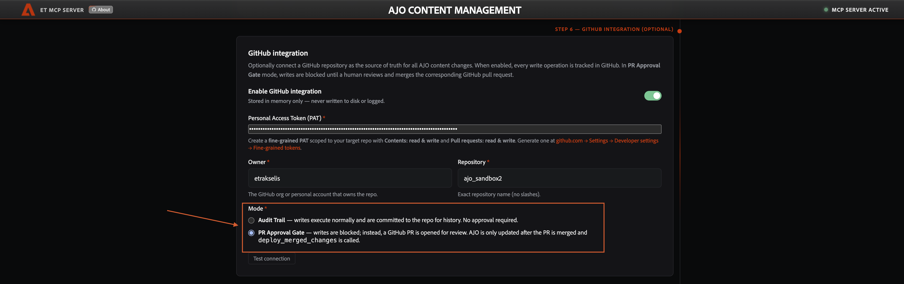</a>

Optionally connect a **GitHub repository** as the source of truth for AJO content changes. When enabled, every content write is tracked in GitHub — either as an audit-trail commit, or, in **PR Approval Gate** mode, as a pull request that must be reviewed and merged before AJO is updated. Fill in the fine-grained **Personal Access Token**, the repo **Owner** and **Repository**, and choose a **Mode**:

- **Audit Trail** — writes execute normally and are committed to the repo for history. No approval required.
- **PR Approval Gate** — writes are blocked; instead a GitHub PR is opened for review, and AJO is only updated after the PR is merged and `deploy_merged_changes` is called.

Click **Test connection** to verify the PAT has access and the repo has at least one commit, then enable the integration. This step is the UI entry point for the feature documented in full — PAT scopes, repository requirements, the file layout in the repo, and the approval workflow — under [GitHub Integration](#github-integration-optional).

> The PAT and these settings are stored **in memory only** — never written to disk or logged.

### Step 7 — Launch

<a href="readme_images/mcp_server_step7.png">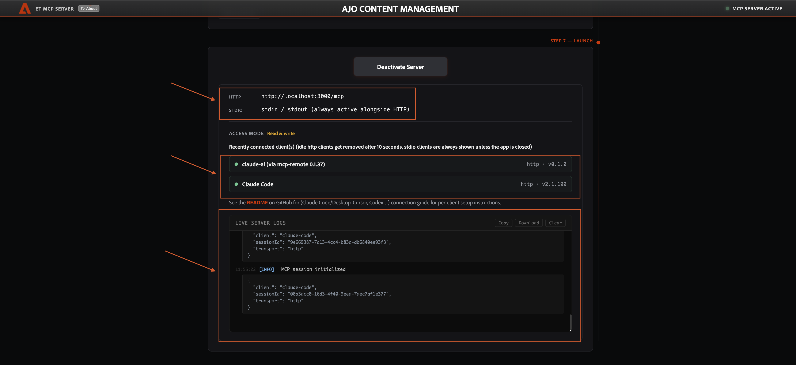</a>

Starting the server authenticates once, caches the token, and begins accepting MCP connections. This final panel is your **live operations dashboard** while the server runs; **Deactivate Server** stops accepting connections. It shows:

- **Connection endpoints** — the **HTTP** URL clients point at (`http://localhost:3000/mcp`) and the **STDIO** transport (`stdin / stdout`, always active alongside HTTP). See the [Client Connection Guide](#client-connection-guide) for per-client setup (Claude Code/Desktop, Cursor, Codex…).
- **Access mode** — the effective read-only vs. read & write state you set in Step 4.
- **Recently connected client(s)** — each connected client with its transport and version (e.g. `claude-ai (via mcp-remote)`, `Claude Code`). Idle HTTP clients drop off the list after ~10 seconds; STDIO clients stay listed until the app closes.
- **Live server logs** — a running feed of server activity (session initialization, tool calls, errors) with **Copy**, **Download**, and **Clear** controls. This is the quickest way to confirm a client actually connected and to debug when one doesn't.

### Audit log

Every content write is appended to an audit trail as one JSON object per line (JSONL), tagged with the email you entered at launch plus the sandbox, tenant namespace, tool, resource ID/name, and timestamp. Records are also mirrored to the server logs (`docker logs ajo-content-mcp`).

```json
{"timestamp":"2026-06-15T06:12:14.161Z","action":"create_content_fragment","authorEmail":"alice@example.com","resourceType":"fragment","resourceId":"b6d70a45-…","resourceName":"Promo Banner","sandbox":"my-sandbox","tenantNamespace":"_mytenant","success":true}
```

The file path is set by the `AUDIT_LOG_PATH` environment variable. `docker-compose.yml` defaults it to `/audit/audit-log.jsonl` and bind-mounts the host's `./audit/` directory there, so the log persists across restarts and lands in your working tree — ready to commit to a **private** repo. (The author email is unverified and self-declared; keep the repo private since the log contains email addresses.)

The author identity is also surfaced to the connected LLM through three channels, in increasing order of reliability:

- **Server `instructions`** sent at connection time (*"You are acting on behalf of &lt;email&gt;…"*). Advisory — some clients don't pass this to the model, so don't depend on it alone.
- **Every tool result** is prefixed with `[… | author: <email>]`, so the identity is visible whenever any tool runs.
- **The `get_server_context` tool**, which returns the author, sandbox, tenant, and write-access state on demand. This is the dependable way to ask the LLM "who is this running on behalf of?" — tools are always visible to the model, unlike the instructions.

These reflect the email entered at the most recent setup; reconnect the client after reconfiguring with a different email.

---

## GitHub Integration (optional)

The server can mirror every AJO content change to a GitHub repository as a structured JSON commit, giving you a full version history of your content assets outside of AJO. You can also use it as a **human-approval gate**: instead of writing to AJO directly, the LLM opens a pull request that a human reviews and merges, then a follow-up tool call applies the approved changes.

The integration is entirely opt-in — the server works normally without it, and you can enable or disable it at any time from the setup UI.

### Two operating modes

| Mode | How it works |
|------|--------------|
| **Audit Trail** | After every successful **content** write (template/fragment), the server asynchronously commits a JSON record of the args and result to the repository. The AJO write is never blocked — if the GitHub commit fails, the write has already succeeded and the server surfaces a warning to the LLM. (Folder and tag operations apply directly to AJO and are **not** mirrored — see [File structure](#file-structure-in-the-repository).) |
| **PR Approval Gate** | Instead of writing to AJO, the LLM opens a branch and a pull request with the proposed **content** (template/fragment). Once a human merges it, call `deploy_merged_changes` with the PR URL to apply the changes to AJO. (Folder and tag writes always apply **directly** to AJO — they're organization metadata, not versioned content; see [File structure](#file-structure-in-the-repository).) |

### Setting up the GitHub PAT

The integration uses a **GitHub fine-grained Personal Access Token (PAT)**, not a classic token. Fine-grained PATs let you scope permissions to a single repository.

1. Go to **GitHub → Settings → Developer settings → Personal access tokens → Fine-grained tokens → Generate new token**.
2. Under **Repository access**, select **Only select repositories** and choose your target repo.
3. Under **Repository permissions**, grant:
   - **Contents: Read and write** — required to commit files and read file content.
   - **Pull requests: Read and write** — required for PR Approval Gate mode (creating and reading PRs).
4. Copy the generated token — it is shown only once.

> **Keep the PAT private.** It is stored in server memory only and is never written to disk, logged, or returned through any MCP tool.

### Repository requirements

- **Empty repositories are handled automatically.** If you point the integration at a brand-new repo with no commits, clicking "Test Connection" will push an initial `README.md` commit via the git HTTPS protocol (using your PAT for auth), so GitHub's git storage is initialized and subsequent REST API commits work normally. The success message will note that the repo was initialized.
- The integration works with **public or private** repositories, as long as the PAT has the permissions above.

### Configuring the integration

In the setup UI at `http://localhost:3000`, the **GitHub Integration** step (Step 6 of the setup flow, just before launch) is where you configure this. Fill in:

- **Personal Access Token** — the fine-grained PAT from the step above.
- **Owner** — the GitHub username or organization that owns the repository (e.g. `acmecorp`).
- **Repository** — the repository name (e.g. `ajo-content`).
- **Mode** — choose **Audit Trail** or **PR Approval Gate**.

Click **Test Connection** to verify the PAT has write access and the repository has at least one commit. Once the test passes, click **Enable GitHub Integration** to activate it.

The integration settings are stored in memory for the lifetime of the server — restart the container and you'll need to re-enter them. This is intentional; secrets are never written to disk.

### File structure in the repository

Each AJO **content** write (template / fragment) produces one JSON file whose path mirrors the sandbox and folder structure you've set up in AJO:

```
{sandbox-name}/
  content-templates/
    {ajo-folder-path}/
      {asset-name}.json
  content-fragments/
    {ajo-folder-path}/
      {asset-name}.json
```

At the **top level there is one directory per sandbox**, so a single repo can mirror several sandboxes side by side (here `etrakselis-sandbox` and `prod`):

<a href="readme_images/github_integration_multiple_sandboxes_example.png">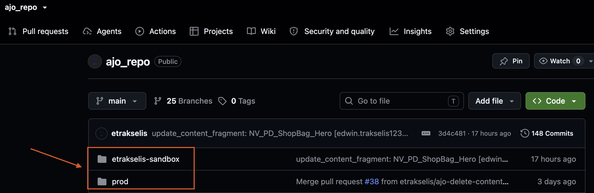</a>

**Within each sandbox, content is split by asset type** into `content-fragments/` and `content-templates/`:

<a href="readme_images/github_integration_asset_types_example.png">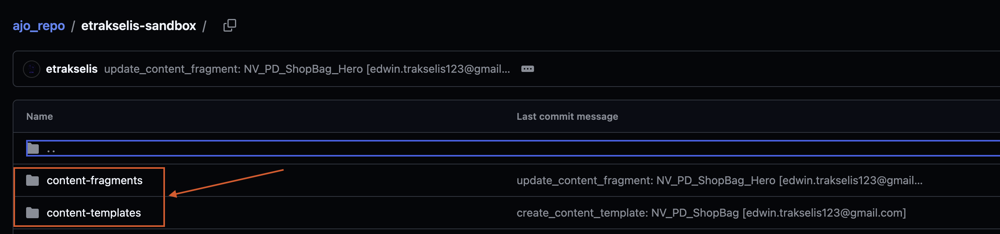</a>

The `{ajo-folder-path}` is resolved by walking the AJO folder hierarchy (e.g. a template in the `BIS › Wishlist` folder under `NV` produces `content-templates/NV/BIS/Wishlist/`). If an asset has no parent folder, it's placed directly under the asset-type directory. The filename is the asset's name (not its UUID), so the repo is human-readable without any ID lookups.

**Folders and tags are not stored as separate files.** The folder tools (`create_folder`, `update_folder`, `delete_folder`, `ensure_folder_path`) **and** the tag tools (`create_tag`, `update_tag`, `delete_tag`) apply **directly to AJO** — no PR, no `folders/` or `tags/` records. The folder hierarchy is implicit in the content paths (promotion re-creates it from where the content files live), and a tag's association is recorded on the content file itself (`_meta.tagNames` + `tagIds`), which is what cross-sandbox promotion reads — it resolves/creates tags by **name** in the target — so a standalone tag file is never read back. Applying tag writes directly (instead of through a PR) also means `create_tag` returns the new tag's **id immediately** rather than only a PR URL, so a brand-new governance tag can be created and attached to content in a single pass. (These writes are still subject to the write-access toggle and the write-confirmation gate, and are recorded in the local audit log; they're just organization metadata, so there's nothing content-bearing to version or review.)

Every file contains a `_meta` block with the operation name, timestamp, author email, sandbox, tenant namespace, and — when the asset is tagged — the tag **names** (`tagNames`, so the repo is self-describing for cross-sandbox promotion, since the raw `tagIds` are environment-local UUIDs), followed by the asset's content. Here is one such file in GitHub — the breadcrumb path (`etrakselis-sandbox / content-fragments / NV / PD / ShopBag / NV_PD_ShopBag_Hero.json`) is the AJO folder hierarchy re-created as directories, and the highlighted `_meta` block sits at the top of the file, ahead of the asset's own content:

<a href="readme_images/github_integration_folderStructure_and_meta_object_example.png">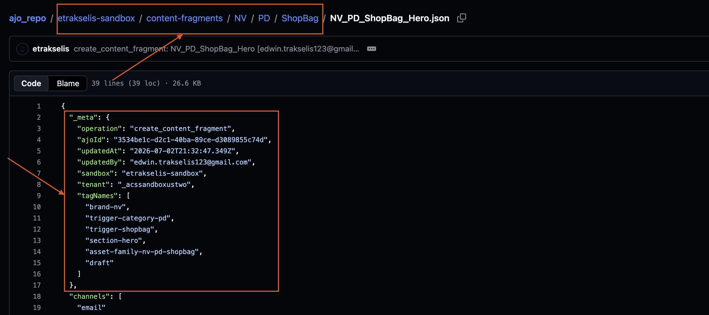</a>

The repo is a **content mirror** of the sandbox, so a sandbox change is never destructive to the repo:

- **create / update** write the asset's full content.
- **patch** (a metadata change) is applied onto the existing committed content — the content body is preserved, and the file stays an accurate snapshot.
- **delete / archive** **never remove content**: the file keeps its content body and only gains a `_meta.deleted` marker (`deleted: true`, plus `deletedAt` / `deletedBy`). So a deleted asset can always be recreated from the repo file (and every prior version remains in git history regardless).

Each operation always commits to the asset's canonical `{asset-name}.json` path (metadata ops resolve the name from the live asset), so there are never id-named files. In **PR Approval Gate** mode the committed file also carries the operation's arguments (id / etag / patches) so `deploy_merged_changes` can replay it — the deploy handler's input schema ignores the extra content fields, so the preserved content never disturbs the AJO call.

**Example commit for `create_content_fragment`** (fragment named `NV_BIS_Wishlist_Hero` in folder `NV › BIS › Wishlist`):
```json
{
  "_meta": {
    "operation": "create_content_fragment",
    "ajoId": "b6d70a45-a149-453b-85ba-809a5d40066d",
    "updatedAt": "2026-06-22T14:32:00.000Z",
    "updatedBy": "alice@example.com",
    "sandbox": "my-sandbox",
    "tenant": "_mytenant",
    "tagNames": ["brand-nv", "section-hero"]
  },
  "name": "NV_BIS_Wishlist_Hero",
  "type": "html",
  "channels": ["email"],
  "fragment": { "content": "<footer>© 2026 Acme Corp</footer>" }
}
```

This file lands at `my-sandbox/content-fragments/NV/BIS/Wishlist/NV_BIS_Wishlist_Hero.json`.

### PR Approval Gate workflow

1. **LLM proposes a change** — instead of calling `create_content_fragment` directly, the LLM opens a PR with the proposed JSON payload. It returns the PR number and URL.
2. **Human reviews and merges** — the PR shows exactly what will be sent to AJO. Merge it on GitHub when you're happy with the content.
3. **Deploy the merged change** — ask the LLM: *"Deploy the changes from [PR URL]."* It calls `deploy_merged_changes`, which reads the merged payload, strips `_meta`, and calls the original tool to write to AJO. The write goes through the normal audit trail and confirmation gate.
4. **Check status** — at any point you can ask: *"What is the status of [PR URL]?"* The `check_pr_status` tool returns whether the PR is open, merged, or closed.

**One open PR per asset (no duplicates).** PR creation is hardened against the two ways a duplicate could otherwise appear:
- **Retry after a transient error.** `POST /pulls` isn't idempotent — a token/permission blip (which GitHub often returns as `404 Not Found`) or a dropped response can make the call throw *after* the PR was actually created, which would make the LLM retry and open a second PR. The server now checks whether a PR already exists on the just-created head branch and recovers it instead of reporting failure.
- **Genuine double-calls.** If the LLM writes to the same asset again while a PR for it is still **open**, the server commits the new payload onto that PR's branch and returns the same PR (updating it in place) rather than opening a second one. It matches by the canonical file the open PR changed; once that PR is merged or closed, the next write opens a fresh PR. (Promotion PRs manage their own lifecycle and are exempt.)

### Example prompts for GitHub integration

> "What's the status of the PR at [PR URL]?"

> "Deploy the approved changes from [PR URL] to AJO."

> "Create a content fragment for our new promo banner, but open a PR for review instead of writing directly."

> "Is the GitHub integration enabled? What repo is it pointing to?"

---

## Cross-Sandbox Promotion (`promote_assets`)

Move content fragments and content templates into a target AJO sandbox — typically **dev → prod** — without re-authoring anything. Two tools do this: `plan_promotion` (a read-only preview) and `promote_assets` (the executor).

**The GitHub repo is the source of truth.** Content is read from the committed JSON files under the *source sandbox's repo subtree* (on the default branch — i.e. reviewed, merged content), **not** from a live source AJO sandbox. So promotion contacts only **one** AJO sandbox at runtime — the target. The credential needs **write access to the target sandbox + read access to the repo**; it does **not** need access to the source sandbox at all.

> This also fixes a latent fragment-shape bug: the repo file holds the original `create` args (the dual-field shape — `fragment.content` = render snippet, `editorContext["wysiwyg-content"]` = full document), whereas a live `get_content_fragment` returns the full document in `content`. Reading from the repo promotes exactly what `create` expects.

### Why it's not just a copy

Every UUID in a fragment or template is **environment-local** — it means something only in the sandbox it was created in. Names and folder paths are the only stable identifiers across sandboxes. So promotion never copies source ids into the target; it reads the repo content, discards source UUIDs, and **re-resolves every cross-reference against the target** (and asserts no source UUID survives the rewiring before staging):

| Reference | In the repo content it holds… | Re-resolved to… |
|-----------|-------------------------------|-----------------|
| Embedded fragment (`{{ fragment id="ajo:…" name="X" }}`) | source fragment UUID | the embed is matched by **`name`** to that fragment's repo file (promoted first); the helper id is rewritten to the **target** fragment's new id |
| Fragment self-reference (`data-fragment-id="ajo:…"`) | source fragment UUID | the `ajo:SELF` sentinel; the target assigns a fresh id on create |
| `parentFolderId` | source folder UUID | the folder path from the **repo file path** is re-created in the target (`ensure_folder_path`); the target leaf id is used |
| `tagIds` | source tag UUIDs | resolved by **name** in the target (from `_meta.tagNames` in the repo file), creating any that are missing |

AJO's export-only `<meta name="acr-content-status">` tag is stripped (AJO rejects it on create). Fragments are **not** auto-published — promotion makes them embeddable, not live.

### Single sandbox, one credential

The IMS/OAuth credential is org/tenant-scoped, not sandbox-scoped. Because content comes from the repo, promotion only ever calls the **target** sandbox — `promote_assets` runs a preflight read against the target and fails fast with a clear permissions error if the credential can't reach it. `sourceSandbox` is just **which repo subtree to read** (it defaults to the server's configured sandbox name — so when the server is pointed at the target, pass `sourceSandbox` explicitly to name the dev subtree); it is never an AJO call.

> **Promotion targets the active sandbox only — switch the server to the target first.** `targetSandbox` MUST be the sandbox currently selected in the server UI; the LLM is restricted to the active sandbox for promotion exactly as for every other operation. A target that isn't the active sandbox is rejected with `TARGET_SANDBOX_NOT_ACTIVE`. So to promote **into** prod: reselect prod as the active sandbox at `http://localhost:3000`, then run `promote_assets` with `targetSandbox: "prod"` and `sourceSandbox` pointing at the dev repo subtree. This guarantees that what the UI shows is the only sandbox the LLM can write to, in every scenario. Every `promote_assets` response includes a `targetSandboxNote` restating this.

### Prerequisites

- **GitHub integration configured**, with the source content already committed to the repo (it gets there automatically when the source assets are created/updated through this server in audit-trail or approval-gate mode). A referenced asset missing from the repo fails with `SOURCE_FILE_NOT_FOUND` — there is no live-source fallback.
- For real (non-dry-run) promotion, GitHub must be in **PR Approval Gate mode** — each promoted asset is proposed as its own PR for human review. (`dryRun: true` works in any mode.)
- Write access enabled, and the credential has access to the **target** sandbox.

### The phased workflow

A template's embed can't be wired until the fragment it embeds is **live** in the target, so promotion runs in dependency phases — leaf fragments first, then their consumers. `promote_assets` is **stateless and resumable**: each call re-derives where it is from (a) what already exists in the target and (b) the PRs it previously opened, then advances. You call it repeatedly, merging the PRs it returns, until it reports `complete`.

```
1.  plan_promotion          → preview the closure, phases, and blockers (writes nothing)
2.  promote_assets          → opens PR(s) for the leaf fragments        → status: awaiting_merge
       (human reviews + merges the fragment PRs on GitHub)
3.  promote_assets          → deploys the merged fragments to the target,
                              then opens PR(s) for the templates         → status: awaiting_merge
       (human reviews + merges the template PRs)
4.  promote_assets          → deploys the merged templates               → status: complete
```

### Updating already-promoted content

Re-promotion handles changes too. For an asset that already exists in the target, `promote_assets` compares a **content fingerprint** (`sourceContentHash`, recorded in `_meta` of the asset's last promotion file in the repo) against the current source:

- **Source unchanged** → reported `unchanged`, skipped (re-running a finished promotion is a no-op — nothing duplicated, no PRs).
- **Source changed** → an `update` PR is opened (a `PUT` that overwrites the target asset). The target asset's UUID is preserved; its content is replaced. The target `etag` is fetched fresh at deploy time (never baked into the PR, where it could go stale before the PR is merged), with a one-shot retry on an etag conflict.

The comparison is **source-vs-source** (this run's source content vs. what was committed at the last promotion), which is immune to AJO re-serializing content on the target — so an unchanged asset never produces a spurious update. Each promotion PR is stamped with a `ajo-promotion-deployed` GitHub **label** once applied, which is how the resumable executor knows a merged update was deployed (target liveness can't tell you that — the asset is already live).

**Idempotent deploy / no duplicates.** AJO does not enforce name uniqueness for fragments — two identically-named fragments can coexist — so deploys dedup by name themselves: when a `create` is applied and a same-named asset already exists in the target, it is **reused** (returned with `action: "reused"`), never duplicated. This holds whether the same merged PR is deployed twice, or you manually run `deploy_merged_changes` on a phase-1 PR and *then* call `promote_assets` to advance. **Best practice: don't run `deploy_merged_changes` on promotion PRs at all — re-invoke `promote_assets` after merging and it deploys and advances the phases for you** (the dedup just makes a mistake here harmless).

> The first re-promotion of assets that were promoted **before** this fingerprinting existed (no recorded hash) opens one update PR each, re-asserting the source — harmless, and a one-time event. A target asset edited directly (outside promotion) is **not** auto-reverted; promotion only acts when the *source* changes. If a promotion PR is closed without merging, that asset (and its dependents) is reported as a blocker and not re-opened until you merge or delete the rejected PR.

### Confirmation

Promotion writes to the **target** sandbox, which **must be the sandbox currently selected in the UI**: `targetSandbox` has to equal the active sandbox, or the call is rejected with `TARGET_SANDBOX_NOT_ACTIVE` (the LLM is bounded by the UI selection for promotion exactly as for every other tool — there is no per-call cross-sandbox write). To promote into prod, **reselect prod as the active sandbox first**, then promote with `sourceSandbox` pointing at the dev repo subtree. The first (and each subsequent) non-dry-run call is then held with `WRITE_CONFIRMATION_REQUIRED` naming the target; confirm with the user, then re-invoke with `confirmWrite: true`. Use `dryRun: true` (or `plan_promotion`) to validate without writing.

> A dry run creates nothing, so a template's embed of an **in-batch** fragment legitimately still holds the source id (there's no target id to rewire to yet) — this is reported as a **warning** naming the phase where it gets rewired, not a blocker. A surviving id for a fragment that is **neither in the batch nor live in the target** (a genuinely dangling embed) is still a blocker. The real phased run rewires every in-batch embed before its write, where the surviving-id guard stays strict.

### Example prompts

> "Plan a promotion of the template `NV_BIS_RestockAlert` from this sandbox to `prod` — show me what it would create."

> "Promote the fragment `NV_BIS_Wishlist_Hero` and everything it depends on to `prod`."

> "I've merged the fragment PRs — continue the promotion of `NV_BIS_RestockAlert` to `prod`."

> "I changed the `NV_BIS_RestockAlert_Hero` fragment in dev — re-promote it to `prod` so prod picks up the edit."

> "Do a dry run of promoting `NV_BIS_RestockAlert` to `prod` and tell me about any blockers."

---

## Same-Sandbox Repo Deploy (`deploy_repo_assets`)

Cross-sandbox promotion (above) requires `source ≠ target`. The related but distinct case is **deploying a sandbox's own committed repo content into that same live sandbox** — e.g. in approval-gate mode you've merged content PRs into the repo and now want it live in the sandbox without hunting down each PR URL. That's what `deploy_repo_assets` (+ the read-only `list_repo_assets`) do.

**It's `deploy_merged_changes`, scaled to a whole subtree.** The repo content on the default branch is already reviewed/merged, so applying it to the active sandbox is a *deployment*, not a new change to gate — it writes **directly** to AJO (no new PR), exactly like `deploy_merged_changes`. References are still re-resolved by name/path (embeds → live fragment ids, folder path re-created, tags resolved/created, self-reference → `ajo:SELF`), so a re-created asset gets correct target ids.

- **Same-sandbox only.** It reads the **active** sandbox's repo subtree and writes the **active** sandbox. For dev → prod, use `promote_assets`.
- **Idempotent / dedup by name.** An asset that already exists is **reused** (`action: "reused"`), never duplicated — so re-running deploys nothing new (e.g. resuming a partial deploy). Absent assets are **created**, in dependency order (fragments before the templates that embed them).
- **Gated like every write.** Honors write access and the confirmation gate (`WRITE_CONFIRMATION_REQUIRED` → re-invoke with `confirmWrite: true`). `dryRun: true` previews without writing.
- **Scope.** Omit `names` to deploy the whole subtree; pass `names` to deploy specific assets (their embedded fragments are pulled in automatically). `sourceRef` selects a git ref (default: the repo default branch).

> **Note:** `deploy_repo_assets` reuses (does not overwrite) an asset that already exists in the sandbox — its job is to make absent content live, idempotently. To push an *edit* of an already-live asset, deploy that asset's specific update PR with `deploy_merged_changes`.

### Example prompts

> "List what's in the `etrakselis-sandbox` subtree of the repo."

> "Deploy everything in the repo's `etrakselis-sandbox` subtree into this sandbox — dry run first."

> "Deploy the `NV_BIS_Restock` template and its fragments from the repo into this sandbox."

---

## Client Connection Guide

> **Prerequisite:** finish [Run](#run) and [Configuration](#mcp-server-configuration) first. There is **one** long-lived container (started by `docker compose up -d`) that you configure once at `http://localhost:3000`. Every client below connects to that same running server at `http://localhost:3000/mcp` — no client starts its own container, so the configuration you entered is shared by all of them and survives client restarts.

### Claude Code (HTTP)
Run this from your terminal — it registers the server in the right place automatically (no file editing needed):
```bash
claude mcp add --transport http et-ajo-content-mgmt http://localhost:3000/mcp
```

### Claude Desktop (via `mcp-remote` bridge)
Claude Desktop's config only speaks STDIO, so it can't point at an HTTP URL directly. The
[`mcp-remote`](https://www.npmjs.com/package/mcp-remote) bridge connects it to the already-running
container — **do not** have Claude Desktop launch its own container, or it would collide with the
one from `docker compose up` (port 3000) and start unconfigured.

**Install Node.js first.** `npx` is not a standalone tool — it ships with npm, which ships with
[Node.js](https://nodejs.org/en/download). Without Node installed, Claude Desktop's `npx` command
fails with `spawn npx ENOENT`. This is the one client that needs Node locally; everything else
talks to the container directly over HTTP. After installing, verify with:
```bash
npx --version
```
You do **not** need to install `mcp-remote` separately — `npx -y mcp-remote` downloads and caches it
on first run (needs network access the first time).

Add to `~/Library/Application Support/Claude/claude_desktop_config.json` (macOS) or
`%APPDATA%\Claude\claude_desktop_config.json` (Windows), then restart Claude Desktop:
```json
{
  "mcpServers": {
    "et-ajo-content-mgmt": {
      "command": "npx",
      "args": ["-y", "mcp-remote", "http://localhost:3000/mcp"]
    }
  }
}
```

> **If Claude Desktop still reports `npx` not found after installing Node:** Claude Desktop launches
> `npx` using the GUI app's `PATH`, which on macOS is often **not** the same as your terminal's
> `PATH` (common with `nvm`- or Homebrew-managed installs). Fix it either by installing Node via the
> official `.pkg` (macOS) / `.msi` (Windows) installer, which puts it in a standard system location,
> or by using the absolute path in the config — find it with `which npx` (macOS) / `where npx`
> (Windows) and set e.g. `"command": "/usr/local/bin/npx"`.

The container from [Run](#run) must already be running and configured. Because that
container is long-lived, your credentials persist across Claude Desktop restarts — you only
configure once at `http://localhost:3000`.

### Cursor
Add via **Settings → MCP Servers → Add Server**, or edit `~/.cursor/mcp.json` (global) or
`.cursor/mcp.json` (project root) directly:
```json
{
  "mcpServers": {
    "et-ajo-content-mgmt": {
      "url": "http://localhost:3000/mcp",
      "type": "http"
    }
  }
}
```

### Codex CLI
`codex mcp add` only supports stdio servers, so add the streamable HTTP endpoint
to `~/.codex/config.toml`:
```toml
[mcp_servers.et-ajo-content-mgmt]
url = "http://localhost:3000/mcp"
```

### Codex Desktop
The Codex IDE extension / desktop app reads the same config file as the CLI.
Add the block above to `~/.codex/config.toml`, then restart Codex.

### Generic HTTP Client
```
MCP Endpoint: http://localhost:3000/mcp
Protocol: Streamable HTTP (MCP 2024-11-05)
```

---

## AEM Assets in AJO Content (optional)

If you want the LLM to embed images stored in AEM (Adobe Experience Manager) into AJO content fragments or templates, you need three things in place before starting a content-authoring conversation.

### 1. Upload your assets to an AJO/AEM folder

Before the LLM can reference an image, the image must already exist in AEM and be accessible from your AJO sandbox.

1. In AEM Assets (or via the AJO Assets picker), **create a dedicated folder** for the campaign or project — e.g. `summer-promo-2026`.
2. **Upload your image files** into that folder.

> Keep all assets for a given campaign in the same folder. This makes it easy to tell the LLM exactly where to look.

### 2. Add the AEM MCP connector to Claude Desktop

The `et-ajo-content-mgmt` server handles AJO content, but it cannot browse AEM Assets on its own. You need the **Adobe Experience Manager** MCP connector running alongside it.

The AEM connector is cloud-hosted and available directly from Claude Desktop's built-in connector library — no JSON config editing required.

1. Open Claude Desktop and click the **connectors** icon to open the connector manager.
2. Browse or search the MCP server library for **Adobe Experience Manager**.
3. Select it and click **Connect** (you may be prompted to authenticate with your Adobe credentials).

Once connected, you should see both connectors active in the connectors dropdown:

<a href="readme_images/claude-connector-aem-example.png">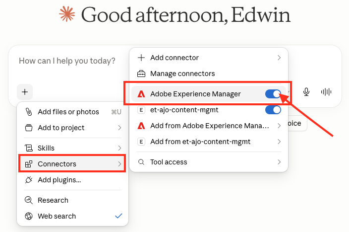</a>

### 3. Tell the LLM which folder to use

The LLM does not automatically know where your assets live. When you start a conversation that involves images, mention the folder name explicitly, for example:

> *"The assets for this campaign are in the AEM folder named **summer-promo-2026**. Please use images from that folder when building the email template."*

The LLM will then use the AEM connector to look up the available images in that folder and embed the correct asset URLs into the AJO content it creates.

---

## Available Tools — Detailed

All tools, with typical arguments. Full input schemas live in `src/tools/`. **Read** tools are always available; **write** tools (marked) run only when write access is enabled (see [Access mode](#step-4--access-mode-optional)). The two GitHub integration tools (`check_pr_status`, `deploy_merged_changes`) are only present when the GitHub integration is enabled.

### Content templates

#### `list_content_templates` *(read)*
```json
{ "limit": 20, "orderBy": "-modifiedAt", "property": ["channels==email", "name~^Welcome"] }
```
All fields optional. Pass `_page.next` from the response as `start` to fetch the next page.

#### `create_content_template` *(write)*
```json
{
  "name": "Welcome Email",
  "templateType": "html",
  "channels": ["email"],
  "template": {
    "html": "<html>Hello {{profile.person.name}}</html>"
  }
}
```
`templateType`: `html` | `html_primary_page` | `html_sub_page` | `content`. `channels`: exactly one of `email`, `push`, `inapp`, `sms`, `code`, `directMail`, `landingpage`, `shared`.

**Organization:** pass `tagIds` (array of tag UUIDs) to tag the new template — these go in the create body directly. Pass `parentFolderId` to file it into a `content-template` folder — the AJO create body rejects `parentFolderId`, so the server applies it via an automatic follow-up `add` PATCH after create; if only that step fails the create still succeeds and a `warnings` entry explains how to retry. `labels` (OLAC access-control strings) are also accepted. On `update_content_template`, `parentFolderId` is ignored (placement is preserved); use `patch_content_template` to move.

#### `get_content_template` *(read)*
```json
{ "templateId": "b6d70a45-a149-453b-85ba-809a5d40066d" }
```
Returns the template and its etag (needed for updates/patches).

#### `update_content_template` *(write)*
Full replacement (PUT). Always fetch first to get the etag:
```json
{
  "templateId": "b6d70a45-...",
  "etag": "\"v2\"",
  "name": "Updated Welcome Email",
  "templateType": "html",
  "channels": ["email"],
  "template": { "html": "<html>Updated content</html>" }
}
```

#### `patch_content_template` *(write)*
Metadata-only changes via JSON Patch. Supported paths: `/name`, `/description`, `/parentFolderId`, `/tagIds`, `/labels`. Use op `add` for `/parentFolderId`, `/tagIds`, `/labels` (members that may not exist yet — the server auto-normalizes `replace`→`add` for these; `/tagIds`/`/labels` set the whole array). For content/type/channel changes use `update_content_template`.
```json
{
  "templateId": "b6d70a45-...",
  "etag": "\"v2\"",
  "patches": [
    { "op": "replace", "path": "/name", "value": "New Name" }
  ]
}
```

#### `delete_content_template` *(write)*
```json
{ "templateId": "b6d70a45-a149-453b-85ba-809a5d40066d" }
```
Permanent deletion.

### Content fragments

#### `list_content_fragments` *(read)*
```json
{ "limit": 20, "orderBy": "-modifiedAt", "property": ["status==PUBLISHED"] }
```
All fields optional. Paginate with `start` = `_page.next`.

#### `create_content_fragment` *(write)*
```json
{
  "name": "Global Footer",
  "type": "html",
  "channels": ["email"],
  "fragment": { "content": "<footer>© 2026 Acme Corp</footer>" }
}
```
For an expression fragment: `"type": "expression"`, `"channels": ["shared"]`, `"fragment": { "expression": "Hello {{profile.person.firstName}}" }`.

**Organization:** pass `tagIds` (array of tag UUIDs) to tag the new fragment — these go in the create body directly. Pass `parentFolderId` to file it into a `fragment` folder — the AJO create body rejects `parentFolderId`, so the server applies it via an automatic follow-up `add` PATCH after create; if only that step fails the create still succeeds and a `warnings` entry explains how to retry. `labels` (OLAC access-control strings) are also accepted. On `update_content_fragment`, `parentFolderId` is ignored (placement is preserved); use `patch_content_fragment` to move.

#### `get_content_fragment` *(read)*
```json
{ "fragmentId": "b6d70a45-a149-453b-85ba-809a5d40066d" }
```
Returns the fragment and its etag. If the fragment is large enough to exceed the ~1 MB MCP tool-result limit (e.g. a big Visual Designer document), the call returns a structured `RESPONSE_TOO_LARGE` error instead of a truncated/opaque result — the same guard protects `get_content_template`, `get_live_fragment`, and the by-UUID resource reads.

#### `update_content_fragment` *(write)*
Full replacement (PUT). Fetch first for the etag:
```json
{
  "fragmentId": "b6d70a45-...",
  "etag": "\"v3\"",
  "name": "Global Footer",
  "type": "html",
  "channels": ["email"],
  "fragment": { "content": "<footer>Updated footer</footer>" }
}
```

#### `patch_content_fragment` *(write)*
Metadata-only changes via JSON Patch. Supported paths: `/name`, `/description`, `/parentFolderId`, `/tagIds`, `/labels`. Use op `add` for `/parentFolderId`, `/tagIds`, `/labels` (members that may not exist yet — the server auto-normalizes `replace`→`add` for these; `/tagIds`/`/labels` set the whole array). For content changes use `update_content_fragment`.
```json
{
  "fragmentId": "b6d70a45-...",
  "etag": "\"v3\"",
  "patches": [
    { "op": "replace", "path": "/name", "value": "New Name" }
  ]
}
```

#### `publish_content_fragment` *(write)*
```json
{ "fragmentId": "b6d70a45-a149-453b-85ba-809a5d40066d" }
```
Publication is async. Poll `get_fragment_publication_status` until `status === "complete"`.

#### `get_live_fragment` *(read)*
```json
{ "fragmentId": "b6d70a45-a149-453b-85ba-809a5d40066d" }
```
Returns the content from the fragment's last successful publication — what campaigns and journeys actually serve right now.

#### `get_fragment_publication_status` *(read)*
```json
{ "fragmentId": "b6d70a45-a149-453b-85ba-809a5d40066d" }
```
Reports the status of the most recent publication request (poll until `status === "complete"`).

#### `archive_content_fragment` *(write)*
```json
{ "fragmentId": "b6d70a45-a149-453b-85ba-809a5d40066d" }
```
Fragments cannot be deleted via the AJO Content REST API — archiving is the equivalent. An archived
fragment is removed from the active library and can no longer be referenced in new campaigns or
journeys.

> **Note:** This tool calls an internal AJO GraphQL API (`exc-unifiedcontent.experience.adobe.net`)
> that is not part of the public Content REST API. If Adobe changes that endpoint, an unexpected
> response is surfaced as a structured `ARCHIVE_API_UNAVAILABLE` error that names a manual fallback
> (archive the fragment in the AJO UI) instead of an opaque failure. The endpoint URL and its app key
> are overridable via the `AJO_ARCHIVE_GRAPHQL_URL` and `AJO_ARCHIVE_API_KEY` environment variables.

### Folders (Unified Folders API)

Organize content into a navigable tree. Every folder call requires **both** a `folderType` (an **onboarded object-family noun**, not free-form) and a `folderId`. **For AJO content the nouns are asymmetric — `fragment` for content fragments and `content-template` for content templates** (note: the fragment noun is `fragment`, *not* `content-fragment`). They are *not* `dataset`/`segment` (other Experience Platform families the same API serves); any non-onboarded noun is rejected with `422` "not onboarded" (the server appends the known content nouns to that error). There is no API to enumerate onboarded nouns. The virtual id `root` addresses the top of a folderType's tree (e.g. for `list_subfolders`). File content into a folder by passing the folder id as `parentFolderId` on `create_content_fragment` / `create_content_template` (or via the patch tools). **Requires the Unified Tags/Folders API enabled on the credential's Developer Console project** (otherwise `FORBIDDEN` / 403). Override the gateway with `AJO_UNIFIED_TAGS_BASE_URL` if needed.

#### `create_folder` *(write)*
```json
{ "folderType": "fragment", "name": "Q3 Campaign", "parentFolderId": "6a5e0927-1527-4abc-9993-376fd7067ca5" }
```
Use `"folderType": "content-template"` for template folders. Omit `parentFolderId` for a top-level folder (it is sent as `parentFolderId: null`). Note the field is `parentFolderId` — the OpenAPI spec's `parentId` is incorrect.

#### `get_folder` *(read)* · `list_subfolders` *(read)* · `validate_folder` *(read)*
```json
{ "folderType": "content-template", "folderId": "83f8287c-767b-4106-b271-257282fd170e" }
```
`get_folder` returns one folder; `list_subfolders` returns its children (walk the tree — use `"folderId": "root"` for the top level); `validate_folder` checks whether the folder is eligible to hold objects.

#### `update_folder` *(write)*
```json
{ "folderType": "content-template", "folderId": "83f8287c-...", "name": "Renamed Folder" }
```
The API only supports replacing the folder name; the tool builds the JSON-Patch op for you.

#### `delete_folder` *(write, destructive)*
```json
{ "folderType": "content-template", "folderId": "83f8287c-..." }
```
Irreversible — confirmed every time.

#### `ensure_folder_path` *(write)*
```json
{ "folderType": "fragment", "path": ["NV", "BIS", "Wishlist"] }
```
Idempotently creates a multi-level folder path, creating only the levels that don't already exist and reusing existing ones. Use this instead of calling `create_folder` level-by-level — it removes the create → duplicate-error → list-subfolders → retry loop that nested folder creation otherwise requires. Returns the leaf folder id and a per-level report of which folders were created vs. reused.

### Tags & tag categories (Unified Tags API)

Classify content for discovery. A **tag** belongs to exactly one **tag category** (`Uncategorized` if none is given at create time). Tags are **org-scoped** — shared across every sandbox in the org (unlike folders, which are per-sandbox): the same tag id appears in all sandboxes, and cross-sandbox promotion reuses a tag by name rather than creating a per-sandbox copy. The `property` argument on the list tools is a filter attribute (e.g. `tagCategoryId=<id>`, `name`, `archived`) — **not** the FIQL grammar used by the content list tools. **Requires the Unified Tags/Folders API enabled on the credential's Developer Console project.**

> **Tag categories are read-only here.** Creating/updating/deleting a tag *category* requires system/product administrator privileges in AJO, which the typical MCP principal does not have — so those operations are intentionally **not exposed** (they would only ever return 403). Use the read tools to discover categories, and create tags in `Uncategorized` for the non-admin path. To bind a tag to content, see `patch_content_fragment` / `patch_content_template` (`/tagIds`).

#### `list_tag_categories` *(read)* · `get_tag_category` *(read)* · `list_tags` *(read)* · `get_tag` *(read)*
```json
{ "property": "tagCategoryId=e2b7c656-067b-4413-a366-adde0401df50", "sortBy": "name", "sortOrder": "asc" }
```

#### `create_tag` *(write)*
```json
{ "name": "summer-sale" }
```
Omit `tagCategoryId` to file the tag under `Uncategorized` (the path that does not require admin rights). Passing a custom `tagCategoryId` requires admin privileges and otherwise returns 403.

#### `update_tag` *(write)*
```json
{ "tagId": "8af14b1e-...", "name": "summer-sale-2026", "archived": false }
```
Provide at least one field to change. The tool sends a **bare JSON-Patch array** of replace ops — `[ { "op": "replace", "path": "archived", "value": "true" } ]` (paths `name` / `archived` / `tagCategoryId`, no leading slash; `value` is always a string, so `archived` is coerced to `"true"`/`"false"`) — and the `experience.adobe.io` gateway wraps it into the backend's `{ patchRequestList: [...] }` envelope itself. (Sending it pre-wrapped causes a double-wrap that the backend rejects.) All supplied fields go in one PATCH. Renaming and archiving need no special rights; **moving a tag into a custom category requires admin privileges** (otherwise 403). To hide a tag without deleting it, set `archived: true`.

#### `validate_tags` *(read)*
```json
{ "ids": ["2bd5ddd9-7284-4767-81d9-c75b122f2a6a", "invalid-tag"] }
```
Returns the valid/invalid split — useful before applying tag references to content.

#### `delete_tag` *(write, destructive)*
```json
{ "tagId": "8af14b1e-..." }
```
Irreversible — confirmed every time. **AJO enforces two preconditions:** the tag must not be applied to any content (otherwise `403 "Associated Tag Count is not Zero"` — clear it from the `/tagIds` of every referencing fragment/template first; since tags are org-scoped, that count spans **every** sandbox, so this includes promoted copies in other sandboxes) and it must be archived (otherwise `409 "Tag is not archived"` — `update_tag` with `archived: true` first). Full teardown order: clear associations → archive → delete. The server surfaces these as resource-specific hints (no stray template/fragment etag guidance).

### Schema Registry / XDM

All read-only. These query the AEP Schema Registry to discover the **actual** personalization attribute paths in the sandbox. Use them before inserting personalization fields so content references attributes that really exist. **Requires the AEP Schema Registry API enabled on the credential's Developer Console project** (otherwise they return `FORBIDDEN` / 403).

> Typical flow: `list_xdm_field_groups` (find the customer's custom groups) → `get_xdm_field_group` (read its attribute paths), or `get_xdm_union_schema` for the complete merged Profile view. Custom attributes are nested under the tenant namespace key (e.g. `_yourtenant`) in the schema's `properties` — that nesting is the personalization path.

#### `list_xdm_schemas` *(read)*
```json
{ "container": "tenant", "property": "title~Profile" }
```
`container` defaults to `tenant` (customer-defined); use `global` for standard XDM. Returns concise summaries (title, `$id`, `meta:altId`, version).

#### `get_xdm_schema` *(read)*
```json
{ "schemaId": "https://ns.adobe.com/_yourtenant/schemas/abc123", "full": true }
```
`full` defaults to `true` (fully resolved — all field groups inlined, complete property tree). Pass the `$id` or `meta:altId` from `list_xdm_schemas`.

#### `list_xdm_field_groups` *(read)*
```json
{ "container": "tenant" }
```
Lists field groups; custom ones (tenant container) are where non-default personalization attributes live.

#### `get_xdm_field_group` *(read)*
```json
{ "fieldGroupId": "https://ns.adobe.com/_yourtenant/mixins/abc123", "full": true }
```

#### `list_xdm_union_schemas` *(read)*
```json
{}
```
Lists union schemas (tenant). A union merges all field groups of a class into one schema — e.g. the full Profile.

#### `get_xdm_union_schema` *(read)*
```json
{ "unionId": "https://ns.adobe.com/xdm/context/profile__union", "full": true }
```
The resolved Profile union is the complete attribute set available for personalization.

### Server context

#### `get_server_context` *(read)*
```json
{}
```
Returns who/what the server is operating as — `authorEmail` (self-declared at setup, unverified), `sandbox`, `tenantNamespace`, `orgName`, `writeAccess`, and `writeConfirmed` (whether the write-confirmation gate is already cleared for this sandbox this session). When GitHub integration is configured it also returns `githubIntegration` — the active write mode (`approval-gate` | `audit-trail`) plus owner/repo/defaultBranch (never the token) — and, in audit-trail mode, `githubIntegration.lastAuditSync`: the outcome of the most recent fire-and-forget commit (`ok: false` means the AJO write succeeded but was **not** recorded in GitHub). Use it to answer "who is this running on behalf of?", "which sandbox am I on?", or "did the last GitHub sync succeed?" without performing a content operation.

It also returns `tools` — the full catalog of every tool this server exposes, grouped by domain (`[{ group, tools: [{ name, title }] }]`). This is the reliable way for a client to discover all capabilities by exact name in a single call, which matters when the client defers tools and a fuzzy tool search ranks one below its result cutoff. The same catalog is also rendered into the server `instructions` at connection time, so the two channels cover each other (instructions need no tool call but are dropped by some clients; this tool result is high-salience but requires the call).

#### `get_naming_convention` *(read)*
```json
{}
```
Returns the administrator-defined naming convention that the server enforces when creating or renaming content templates, fragments, folders, and tags. Call before assigning any name to ensure compliance. Returns `{ enabled, rules }` — `rules` is the full convention in Markdown when a convention is configured, or `null` when none is set.

### GitHub integration tools

These tools are only exposed when the [GitHub Integration](#github-integration-optional) is enabled. They are read-only from the perspective of AJO — they interact with GitHub, not with AJO's Content API.

#### `check_pr_status` *(read)*
```json
{ "prUrl": "https://github.com/owner/repo/pull/42" }
```
Returns the PR's number, state (`open` | `closed`), whether it has been merged, its title, and the merge commit SHA (if merged). Use this before calling `deploy_merged_changes` to confirm the PR is ready.

#### `deploy_merged_changes` *(write)*
```json
{ "prUrl": "https://github.com/owner/repo/pull/42" }
```
Reads the JSON payloads from a merged pull request (created by the PR Approval Gate mode) and re-executes the AJO write operations they describe. Each file in the PR that has a valid `_meta.operation` produces one write call. Requires the PR to be merged — the call fails with a clear error if the PR is still open or was closed without merging.

The `_meta` block is stripped before the args are passed to the AJO tool, so only the original content payload reaches the API. Each operation goes through the normal write-confirmation gate (and is logged to the audit trail if it succeeds).

### Cross-sandbox promotion

See [Cross-Sandbox Promotion](#cross-sandbox-promotion-promote_assets) for the full workflow and rationale.

#### `plan_promotion` *(read)*
```json
{ "templateName": "NV_BIS_RestockAlert", "sourceSandbox": "etrakselis-sandbox", "targetSandbox": "prod" }
```
Builds a read-only plan from **repo content** (no source-sandbox calls): the dependency closure (template → embedded fragments → nested fragments, matched by embed name), the phase order, each asset's repo path / target folder path / embeds, and whether it already exists in the target (`targetStatus: absent | present`). Surfaces blockers (`SOURCE_FILE_NOT_FOUND`, an embed name with no repo file, malformed helpers) before any write. Provide exactly one of `templateName`, `fragmentName`, or `names`; `sourceSandbox` is the repo subtree to read (defaults to the configured sandbox name); optional `sourceRef` selects a branch/tag/commit (default: the repo's default branch). `targetSandbox` must be the active (UI-selected) sandbox (same restriction as `promote_assets`, else `TARGET_SANDBOX_NOT_ACTIVE`). Requires GitHub configured + target read access.

#### `promote_assets` *(write)*
```json
{ "templateName": "NV_BIS_RestockAlert", "sourceSandbox": "etrakselis-sandbox", "targetSandbox": "prod", "confirmWrite": true }
```
Promotes the selection to `targetSandbox` — which **must be the active (UI-selected) sandbox** (reselect it first; a non-active target is rejected with `TARGET_SANDBOX_NOT_ACTIVE`) — reading content from the **GitHub repo** (not the source sandbox) and re-resolving every environment-local UUID against the target (embeds matched by name → target fragment ids, self-reference → `ajo:SELF`, folder path from the repo file path re-created in target, tags resolved/created from `_meta.tagNames`). Contacts only the target AJO sandbox. Requires GitHub configured (and **PR Approval Gate mode** for real writes) — each asset is proposed as its own PR. Phased and resumable: each call deploys any of its merged PRs and opens PRs for the next assets whose dependencies are now live; call again until `status: complete`. Requires `confirmWrite: true` (after the target is confirmed with the user); `dryRun: true` validates without writing. Absent assets are **created**; already-present assets are **updated** when their repo source changed since the last promotion (via a `sourceContentHash` fingerprint), else reported `unchanged` — never duplicated. See [Updating already-promoted content](#updating-already-promoted-content).

#### `list_repo_assets` *(read)*
```json
{ "sourceSandbox": "etrakselis-sandbox" }
```
Enumerates the content fragments, templates, **and tags** committed under a sandbox's repo subtree (reads the repo, not AJO). `sourceSandbox` defaults to the active sandbox; `sourceRef` defaults to the repo default branch. Returns `{ sandbox, sourceRef, truncated, assets: [{ name, type, path }] }` where `type` is `"fragment"`, `"template"`, or `"tag"`. Use it to preview what's in the repo or resolve names for `deploy_repo_assets` / `promote_assets`. (Tags are org-global — shared across sandboxes — so a tag listed here only marks the subtree where it was first committed; for the authoritative live tag list use `list_tags`.)

#### `deploy_repo_assets` *(write)*
```json
{ "names": ["NV_BIS_Restock"], "dryRun": true }
```
Deploys the **active** sandbox's repo subtree into the **active** AJO sandbox (same-sandbox repo → live) — the whole-subtree analog of `deploy_merged_changes`. Applies directly (no new PR — the repo content is already merged/approved), in dependency order, re-resolving embeds/folders/tags/self-references by name/path. Idempotent + dedup by name: an existing asset is **reused** (`action: "reused"`), never duplicated; absent assets are **created**. Omit `names` for the whole subtree. Requires GitHub configured + write access; held with `WRITE_CONFIRMATION_REQUIRED` until re-invoked with `confirmWrite: true`; `dryRun: true` previews. For dev → prod use `promote_assets` instead. See [Same-Sandbox Repo Deploy](#same-sandbox-repo-deploy-deploy_repo_assets).

### Authoring references

Read-only reference content, delivered as tools so the model can fetch it on its own even in clients that can't read MCP resources directly (e.g. Claude Desktop). The `create_*` / `update_*` tools' descriptions point the model here before it authors HTML or personalization.

#### `get_visual_designer_requirements` *(read)*
```json
{}
```
Returns the complete AJO Visual Email Designer HTML authoring spec (non-negotiable rules, the fixed nesting chain, the full structure and component catalogs, the verbatim required `<head>`, a known-good minimal template, and a pre-output checklist). Call it before constructing email HTML (`templateType` `html`, or `content` `html.body`, channel `email`) or HTML fragments — generic email HTML imports in Compatibility mode and loses drag-and-drop editing.

#### `get_personalization_syntax` *(read)*
```json
{}
```
With **no argument**, returns the index: a syntax primer plus the menu of categories. Pass a `category` to fetch one full section (the library is large, so it's served one category at a time):
```json
{ "category": "dates" }
```
Categories: `core`, `helpers`, `operators`, `strings`, `dates`, `arrays`, `aggregation`, `arithmetic`, `objects`, `maps`, `context-iteration`, `dataset-lookup` (or `all` for the entire library). Covers AJO-native personalization **syntax** — expression language, helper functions, conditionals, loops, dataset lookup. This is syntax only; get the real attribute **paths** from the Schema Registry tools or the `discover-personalization-paths` prompt, and never guess paths or emit JavaScript/Liquid/Jinja.

#### `get_personalization_guidance` *(read)*
```json
{}
```
Returns the AJO personalization strategy guide — **when** and **what** to personalize while authoring content. Covers the discovery process, data-source resolution order (profile → journey context → event payload → dataset lookup), detecting collections that require iteration, what fields to personalize (customer, transaction, event, offer, URLs, images, dates), conditional content, and a final coverage/validation checklist. This is the strategy layer; pair it with `get_personalization_syntax` (how to write expressions) and the Schema Registry tools (real attribute paths).

#### `get_email_scenario_faq` *(read)*
```json
{}
```
Returns the AJO **email scenario FAQ & clarifying-question playbook** — the triage/conversation layer for authoring email content. It's a scenario catalog (not a one-shot spec): it lets the model **recognize** the common email personalization scenarios in a request or a provided HTML email (data-source resolution, global variables, reusable header/footer fragments, preheader, product feeds, sorting, eligibility filtering, counters, price/text transforms, star ratings, tracking/deep-link/UTM links, images → media library, recommendation trays, conditional content, execution metadata, compliance links), **recall** the AJO solution for each, and — the point of the file — **ask the user the right clarifying questions** so the content fragments and template land configured for their use case. Call it **first** when the user asks to create a new AJO email or convert an existing HTML email; it then defers to `get_visual_designer_requirements` (HTML format), `get_personalization_guidance` / `get_personalization_syntax` (personalization), and the Schema Registry tools (real attribute paths).

#### `get_aem_image_embed_instructions` *(read)*
```json
{}
```
Returns the step-by-step procedure for resolving the three AJO media-library embed attributes required when inserting an AEM DAM image into content: `data-medialibrary-id` (the asset's `jcr:uuid` in URN form), `data-mediarepo-id` (the AEM author host), and `data-medialibrary-source` (`"aem"`). Without the correct values the image will not resolve from the media library. Call this before embedding any AEM-hosted image via `create_content_fragment`, `update_content_fragment`, `create_content_template`, or `update_content_template`. The guide explains how to obtain the values through a separate AEM MCP server.

---

## MCP Resources

Alongside its tools, the server exposes MCP **resources** — addressable, readable context a client can fetch directly (and, in clients with a resource picker, attach via `@`-mention) without invoking a tool. All resources use the `ajo://` URI scheme.

> **Claude Desktop note:** attaching these resources to the chat via the **+** menu currently **fails in Claude Desktop** ("failed to attach resource"). This is a limitation in how Claude Desktop handles local servers bridged through `mcp-remote` — it affects *every* such server (including Adobe's own AJO MCP server), and is **not** a sign that this server is broken. It does **not** affect functionality: all tools work normally, and the same reference content is reachable by the model through tools — `get_visual_designer_requirements` for the Visual Email Designer spec, and `get_server_context` for the full catalog of tools *and* resources (each listed with how to obtain it). See [Troubleshooting](#claude-desktop-failed-to-attach-resource-in-the-chat-ui).

### Static resources

These are always listed (via `resources/list`) and have fixed URIs.

| URI | Description |
|-----|-------------|
| `ajo://server/status` | Live configuration and authentication status (JSON): server name/version, whether it's configured, auth state, write access, and tool count. |
| `ajo://sandbox/channel-reference` | Canonical reference (text) mapping AJO channels to valid `templateType` values, required template/fragment content shapes, and `subType` options. Read before constructing create/update payloads. |
| `ajo://error-codes` | Reference (text) of every error code the server can return, with cause and recovery action for each. |

### Browsable collections

Name→id **directories**, so a human or client can locate an object by name and then drill into it — solving the discovery problem that bare UUIDs can't (nobody knows a fragment's UUID by heart). Each entry includes a `resource` link to the per-object resource below.

| URI | Description |
|-----|-------------|
| `ajo://fragments` | Directory of content fragments (`{ count, truncated, next?, items: [{ id, name, type, status, channels, modifiedAt, resource }] }`). Follows the API's pagination cursor to include every fragment, bounded by a safety cap (up to 5,000); if the cap is hit, `truncated` is `true` and `next` carries a resume cursor. |
| `ajo://templates` | Directory of content templates, same shape (with `templateType` in place of `type`/`status`). |

### Templated resources (by UUID)

Listed via `resources/templates/list`. The `{id}` variable is the object's UUID; resolving the URI returns the live object plus its current etag — so the etag needed for a follow-up update/patch comes back with the read, no extra fetch.

| URI template | Description |
|--------------|-------------|
| `ajo://fragment/{id}` | A single content fragment by UUID, as JSON (`{ data, etag }`). |
| `ajo://template/{id}` | A single content template by UUID, as JSON (`{ data, etag }`). |

> **Argument completion:** for the `{id}` of the templated resources, the server provides live autocompletion (via the MCP completions capability) backed by the current fragment/template list, so clients that support it can suggest real IDs as you type.

A typical browse-then-read flow: read `ajo://fragments` to find the fragment named "Global Footer" and its id → read `ajo://fragment/<that-id>` for the full object and etag. The `get_content_fragment` / `get_content_template` tools remain the model-driven equivalent of the per-object read.

---

## MCP Prompts

Beyond the free-form [Example Prompts](#example-prompts) above (which you type yourself), the server also publishes **MCP prompts** — named, parameterized workflows the client surfaces as ready-to-run commands (e.g. Claude Desktop's slash-command / prompt picker). Selecting one injects a fully-formed, multi-step instruction set into the conversation, so the model executes a known-good procedure instead of improvising. Each prompt also **embeds the relevant reference resource** inline (the channel reference or error-code reference), so the model has it on hand while running the workflow rather than having to fetch it.

> **Claude Desktop note:** the slash-command / prompt picker **does not work** when this server is connected via the `mcp-remote` bridge (the setup described in [Client Connection Guide → Claude Desktop](#claude-desktop-via-mcp-remote-bridge)). This is the same limitation as resource attachment — Claude Desktop cannot surface prompts or resources from servers connected through a remote bridge. It is **not** a problem with this server; it affects every local server bridged through `mcp-remote`. The prompts work normally in clients that connect natively over HTTP (Claude Code, Cursor, VS Code). In Claude Desktop, use the free-form [Example Prompts](#example-prompts) instead — they cover the same workflows.

| Prompt | Argument(s) | What it does |
|--------|-------------|--------------|
| `create-content` | `channel` *(required)* — email, push, sms, inapp, code, directMail, landingpage, or shared; `content_kind` *(optional)* — `template` (default) or `fragment`; `name` *(optional)*; `use_case` *(optional)* | Walks the full creation workflow: confirms the correct `templateType`/`type` and content shape for the channel, reads the Visual Email Designer requirements for email, looks up real XDM personalization paths and the AJO syntax when the content is personalized, confirms the complete payload with you, then calls `create_content_template` / `create_content_fragment`. Embeds the channel reference (plus the visual-designer requirements for email). |
| `discover-personalization-paths` | `use_case` *(optional)* — what you want to personalize, e.g. "greet by first name" | Walks the XDM lookup sequence (`list_xdm_field_groups` → `get_xdm_field_group`, or the Profile union) to find the **real** attribute paths in this sandbox, so personalization expressions reference attributes that actually exist instead of guessed defaults, then points to `get_personalization_syntax` for the expression syntax. Embeds the channel reference. |
| `publish-fragment` | `fragment_id` *(required)* — UUID of the fragment | Runs the full async publish-and-verify workflow: check current state → trigger publication → poll `get_fragment_publication_status` until `complete` or `error`. Embeds the error-code reference for recovery. |
| `audit-content-library` | `content_type` *(optional)* — `templates`, `fragments`, or `both` (default `both`) | Surveys the sandbox: pages through all content, groups by type/channel/status, and flags action items (stale templates, drafts never published, fragments with failed/in-progress publications). Embeds the channel reference. |

> **Argument completion:** the server provides autocompletion for prompt arguments (via the MCP completions capability) — `content_type` offers the static `templates`/`fragments`/`both` choices, and `publish-fragment`'s `fragment_id` is backed by a live lookup of fragments in the sandbox, so clients that support it suggest real IDs as you type.

These map to the workflow guidance the server's `instructions` point the model at — use `create-content` for the guided create workflow, `discover-personalization-paths` before inserting any `{{ }}` expression, `publish-fragment` for the full publication cycle, and `audit-content-library` to take stock of a sandbox.

---

## Observability

| Endpoint | Description |
|----------|-------------|
| `GET /health` | Liveness check — always 200 when running |
| `GET /ready` | Readiness — 200 only after credentials configured |
| `GET /metrics` | Prometheus metrics (tool calls, errors, latency, auth refreshes) |

### Prometheus Metrics
- `mcp_tool_calls_total{tool, status}` — total tool invocations
- `mcp_tool_call_duration_seconds{tool}` — latency histogram
- `mcp_auth_refresh_total` — IMS token refresh count
- `mcp_adobe_api_errors_total{endpoint, status_code}` — API errors

---

## Security

The server has **no application-layer authentication** — its security boundary is **network isolation**. It binds to **loopback (`127.0.0.1`) by default** (`src/server/index.ts`), and the Docker image publishes its port only to the host loopback (`127.0.0.1:3000:3000`). Treat it as a single-user local tool.

> ⚠️ **If you expose it on the network** (`HOST=0.0.0.0`, or publishing the container port beyond loopback), put an **authenticating reverse proxy in front of it.** The guards below stop cross-site browser requests and DNS-rebinding — they do **not** authenticate a direct HTTP client that can already reach the port, so without a proxy anyone on the network could upload credentials, flip write access, or call `/mcp`.

**Secret handling**
- Adobe credentials and the GitHub PAT are held **in memory only** — never written to disk, and never returned through any MCP tool or `/api/*` response.
- Logs are **recursively scrubbed** (`redactSecrets`): secret-bearing keys (client secret, API key, `*token`, PAT, `Authorization` headers) are masked at any nesting depth — the client secret is never logged, only a `hasClientSecret` boolean. The setup-phase probe-token cache is keyed by a **SHA-256 hash** of the credentials, never the raw secret.
- The append-only audit log records the (self-declared) author email + resource identifiers, **no secrets** — keep its repo/volume private since it contains email addresses.

**Write safety**
- Writes are gated by a runtime **read-only toggle (default off)** enforced at call time, plus a **write-confirmation step** that confirms the target sandbox before any change (destructive/irreversible ops re-confirm every time). See [Access mode](#step-4--access-mode-optional) and the write-confirmation notes above.

**HTTP hardening** (the loopback `/` setup UI and the `/mcp` endpoint)
- **Helmet** headers with a strict **Content-Security-Policy** — `script-src 'self'` (the setup page's JS is served as a separate `/app.js`, so there are no inline scripts), plus `object-src 'none'`, `frame-ancestors 'none'`, `base-uri 'self'`; `style-src` keeps `'unsafe-inline'` (inline CSS can't execute JS).
- **CORS** locked to loopback origins by default (`localhost` / `127.0.0.1`, any port); override with `CORS_ORIGIN`.
- **CSRF guard** on every state-changing endpoint (`/api/configure`, `/api/access-mode`, `/api/sandbox`, `/api/deactivate`, `/api/list-sandboxes`, `/api/detect-tenant`, `/api/github-test`): rejects any request a browser marks cross-site (`Sec-Fetch-Site`) or that carries a non-loopback `Origin`. Non-browser MCP clients (which send neither header) pass through.
- **DNS-rebinding defense** on `/mcp`: a Host-header allowlist rejects any non-loopback `Host` (override via `MCP_ALLOWED_HOSTS` for a proxied deployment).
- 2 MB JSON body limit; unhandled errors return structured JSON with **no stack traces** leaked to clients.

**Rate limiting** (per-IP, 60-second windows)
- Global **200/min**; auth-sensitive endpoints (`/api/configure`, `/api/detect-tenant`, `/api/github-test`) **5/min**; sandbox discovery (`/api/list-sandboxes`) **20/min**; the `/mcp` endpoint **500/min** (busy MCP sessions need more headroom than the UI).

**Input validation & container hardening**
- All tool inputs are validated with **Zod** before any AJO call.
- Docker: **non-root user** (`mcpuser`), **read-only root filesystem** (with a `tmpfs` for scratch space), and **`no-new-privileges`**.

---

## Development

```bash
# Install dependencies
npm install

# Run tests
npm test

# Run with coverage
npm test -- --coverage

# Type-check only
npm run typecheck

# Run locally (no Docker)
npm run dev
```

### Build the Docker image from source

End users pull the pre-built image (see [Run](#run)), but contributors can build it locally from the `Dockerfile`. Layer the build override on top of the default compose file:

```bash
docker compose -f docker-compose.yml -f docker-compose.build.yml up -d --build
```

This builds the image locally instead of pulling from GHCR; all other settings (ports, audit volume, security options) are inherited from `docker-compose.yml`.

### Publishing a new image

The [`Publish image`](.github/workflows/release.yml) GitHub Actions workflow builds the multi-arch image (`linux/amd64` + `linux/arm64`) and pushes it to GHCR. Push a version tag to release:

```bash
git tag v1.0.1 && git push origin v1.0.1   # publishes :1.0.1, :1.0, and :latest
```

You can also trigger it manually from the **Actions** tab (publishes `:latest`). The first push creates the GHCR package as **private** — make it **public** once (GitHub → your profile → Packages → `ajo-content-mcp` → Package settings → Change visibility) so end users can pull without `docker login`.

### Packaging the distribution bundle

To hand the server to an end user who won't clone the repo, zip the self-contained [`distribution/`](distribution/) folder (an abridged `README.md` + a pull-only `docker-compose.yml`):

```bash
zip -r ajo-content-mcp-quickstart.zip distribution/
```

The recipient unzips it, then runs `docker compose up -d` from the folder — no source, no build. If you change the root `docker-compose.yml`, keep `distribution/docker-compose.yml` in sync (it's a deliberate standalone copy so the bundle has no repo dependencies).

---

## Troubleshooting

### Authentication issues
- Ensure `CLIENT_SECRET` and `API_KEY` are correct in your credentials file
- Alternatively, provide a pre-obtained `ACCESS_TOKEN` directly
- Check `/ready` endpoint for auth status

### Sandbox issues
- Prefer selecting the sandbox from the auto-populated dropdown — it lists exactly the sandboxes your credentials can access
- If the dropdown is empty or falls back to manual entry, the Sandbox Management API may not be enabled on your Developer Console project, or the credentials may lack permission to list sandboxes
- Manually entered sandbox names are case-sensitive — find the exact name in Adobe Experience Platform → Sandbox switcher, or in your AJO URL under the `sname:` parameter

### Connectivity issues
- Verify the container is running: `docker ps`
- Check container logs: `docker logs ajo-content-mcp`
- Ensure port 3000 is not in use

### Adobe API issues
- `401 UNAUTHORIZED`: Token expired — restart the server to re-authenticate
- `403 FORBIDDEN`: Check that your API key has the required AJO Content permissions
- `404 NOT_FOUND`: Verify the template/fragment ID and sandbox
- `409 CONFLICT`: ETag mismatch — fetch the resource again to get the latest etag

### Tool not working
- Check `/ready` returns `{ "ready": true }`
- Verify the MCP client is connected to `http://localhost:3000/mcp`
- Review logs: `docker compose logs -f`

### Claude Desktop: "failed to attach resource" in the chat UI
Attaching this server's **resources** or **prompts** to the chat via the **+** menu fails in Claude Desktop ("failed to attach resource" / "server not found"). **This is a Claude Desktop limitation, not a problem with this server**, and it does **not** affect functionality.

- It affects **every** local server connected through the `mcp-remote` bridge — reproducible with Adobe's own AJO MCP server too, not just this one.
- The server is healthy: the request actually **succeeds** at the protocol level. `docker compose logs -f` shows the `resources/read` / `prompts/get` returning a normal result — the failure is purely in Claude Desktop's attach UI.
- **Tools are unaffected** and work normally (they use a different path than the resource picker).
- The model can still reach the same content through tools: call **`get_visual_designer_requirements`** for the Visual Email Designer HTML spec, and **`get_server_context`** for the full catalog of tools *and* resources (each resource listed with an "access" hint for how to obtain it).
- Resources *do* attach normally in clients connected as **native/remote** connectors, and in any client that supports reading MCP resources directly.

### Which server actually handled a request?
LLM clients **cannot reliably report their own MCP connections** — if you ask the model "which MCP servers are you connected to?" or "which server did you use?", it may omit this local server, list unrelated cloud connectors, or claim it was "proxied" through another server. That's the model guessing from tool names, not ground truth.

To confirm this server did the work, use authoritative signals instead:
- **Container logs** are the source of truth — every tool call is logged: `docker compose logs -f` (look for entries like `create_content_fragment`).
- The landing page's **Connected client** panel at `http://localhost:3000` shows the live connection (e.g. `Claude Desktop · http`).
- This server's tools are namespaced under **`et-ajo-content-mgmt`** — that prefix is the real one.
- `mcp-remote` connects **directly** to `http://localhost:3000/mcp`; it does not route through any cloud service.

If a client also has **cloud Adobe/AJO connectors** enabled (e.g. via its connectors UI), their tools overlap in purpose with this server's and the model may conflate them. Disable the ones you aren't using so `et-ajo-content-mgmt` is unambiguous.

### Connected-client list seems out of date
Each client gets its own MCP **session**, and the **Connected client** panel tracks those sessions — so the list stays correct even with several clients connected at once (e.g. Claude Code and Claude Desktop). Activity on one client's session never refreshes another's.
- **A client you just closed still shows:** when a client disconnects cleanly its session ends and it's removed promptly. If it lingers, give it up to ~10 seconds (the safety-net window for an unclean exit). For Claude Desktop, make sure the app fully quit (not just the window closed) so the `mcp-remote` bridge process actually exits.
- **A connected client isn't listed:** it appears as soon as it sends anything, and every tool call keeps it listed. If it's missing, run any tool and it'll reappear.
- The list reflects connections to the **running container**; restarting it (`docker compose restart`) clears the list entirely.

---

## Architecture

```
.
├── src/
│   ├── server/
│   │   ├── index.ts            Entry point — starts STDIO + HTTP transports, graceful shutdown
│   │   └── app.ts              Express app — landing page (+ its /app.js script), /api/* config endpoints, /mcp endpoint
│   ├── mcp/
│   │   ├── server.ts           MCP server factory, tool routing, resources, prompts, STDIO/HTTP setup
│   │   ├── resources.ts        Static, collection, and templated resource definitions (ajo:// URIs)
│   │   ├── prompts.ts          Guided workflow prompt definitions (discover-personalization-paths, etc.)
│   │   ├── personalization-syntax.ts        Loads + splits the personalization syntax library asset into categories
│   │   ├── personalization-guidance.ts      Loads the AJO personalization scenarios/strategy guidance asset (get_personalization_guidance)
│   │   ├── visual-designer-requirements.ts  Loads the AJO Visual Email Designer HTML spec asset (get_visual_designer_requirements)
│   │   ├── aem-asset-instructions.ts        Loads the AEM image embed-attribute retrieval procedure (get_aem_image_embed_instructions)
│   │   ├── email-scenario-faq.ts            Loads the AJO email scenario FAQ & clarifying-question playbook asset (get_email_scenario_faq)
│   │   ├── tool-catalog.ts     Builds the grouped tool catalog (for get_server_context + instructions)
│   │   ├── access-policy.ts    Runtime read-only / write-access toggle
│   │   ├── sandbox-change.ts   Live sandbox-switch notifier — emits tools/resources list_changed when the active sandbox is reselected
│   │   ├── github-audit-status.ts  Tracks the last GitHub audit-trail commit outcome (surfaced via get_server_context.lastAuditSync)
│   │   ├── connected-clients.ts  Tracks which MCP clients are connected (for the landing page)
│   │   └── sdk-types.d.ts      Local type declarations for the MCP SDK
│   ├── tools/
│   │   ├── templates.ts        Content template tool definitions + handlers
│   │   ├── fragments.ts        Content fragment tool definitions + handlers
│   │   ├── folders.ts          Folder organization tool definitions + handlers (Unified Folders API)
│   │   ├── tags.ts             Tag & tag-category tool definitions + handlers (Unified Tags API)
│   │   ├── github.ts           check_pr_status and deploy_merged_changes tool definitions + handlers
│   │   ├── promotion.ts        plan_promotion / promote_assets (cross-sandbox) + list_repo_assets / deploy_repo_assets (same-sandbox repo→live) definitions + handlers
│   │   ├── schema-registry.ts  XDM schema / field group / union lookup tools (read-only)
│   │   ├── visual-designer.ts  get_visual_designer_requirements tool — AJO email HTML spec (read-only)
│   │   ├── aem-assets.ts       get_aem_image_embed_instructions tool — AEM image embed-attribute procedure (read-only)
│   │   ├── personalization.ts  get_personalization_syntax + get_personalization_guidance tools (read-only)
│   │   ├── email-scenario.ts   get_email_scenario_faq tool — AJO email scenario FAQ & clarifying-question playbook (read-only)
│   │   ├── context.ts          get_server_context + get_naming_convention tools (read-only)
│   │   └── utils.ts            Shared tool helpers — output-schema envelope, telemetry wrapper, RESPONSE_TOO_LARGE guard, content-warning/embed scanners
│   ├── promotion/
│   │   └── engine.ts           Repo-sourced deploy engine — dependency graph, payload rebuild, cross-sandbox phased PRs (promote_assets) + same-sandbox direct deploy (deploy_repo_assets)
│   ├── github/
│   │   ├── client.ts           GitHub REST API client — PAT auth, repo/file/branch/PR operations
│   │   ├── sync.ts             Audit-trail commit and PR approval-gate logic (commitAuditTrail, createApprovalPR, readMergedPRContent)
│   │   └── types.ts            GitHubConfig type (token, owner, repo, defaultBranch, mode)
│   ├── reference/             Shipped Markdown assets, loaded by the mcp/ loaders above and served via the read-only reference tools
│   │   ├── ajo-personalization-syntax-library.md      Personalization syntax library (get_personalization_syntax)
│   │   ├── ajo-personalization-scenarios-guidance.md  Personalization strategy/scenarios guidance (get_personalization_guidance)
│   │   ├── ajo-visual-designer-requirements.md        Visual Email Designer HTML spec (get_visual_designer_requirements)
│   │   ├── aem-assetid-retrieval-instructions.md      AEM image embed-attribute retrieval procedure (get_aem_image_embed_instructions)
│   │   ├── ajo-email-scenario-faq.md                  AJO email scenario FAQ & clarifying-question playbook (get_email_scenario_faq)
│   │   └── ajo-content-asset-governance-rules.md      Content asset governance & naming-standard reference asset
│   ├── adobe/
│   │   ├── client.ts           AJO Content API client (axios + retry, injects auth headers)
│   │   ├── unified-tags-client.ts  Unified Tags/Folders API client (tags, categories, folders, folder-path resolution)
│   │   ├── sandbox-context.ts  Per-call sandbox override (AsyncLocalStorage) for cross-sandbox reads/writes
│   │   └── schema-registry-client.ts  AEP Schema Registry (XDM) read client
│   ├── auth/
│   │   └── token-manager.ts    Adobe IMS token acquisition with caching + refresh
│   ├── validation/
│   │   └── schemas.ts          Zod schemas for the credentials file and tool inputs
│   ├── telemetry/
│   │   ├── index.ts            Winston logging + Prometheus metrics registry
│   │   └── audit.ts            Append-only JSONL audit trail for content writes
│   └── ui/
│       ├── landing.ts          Single-page setup UI — page HTML (served at /) + the client script (served as /app.js)
│       └── naming-convention-default.ts  Default administrator naming-convention ruleset (pre-filled in the setup UI)
├── Dockerfile                  Multi-stage build (npm ci → tsc → slim runtime image)
├── docker-compose.yml          Builds the image and runs the container
├── package.json                Dependencies and scripts
├── tsconfig.json               TypeScript compiler configuration

```

The server boots both transports in `src/server/index.ts`: an **STDIO** transport and an **HTTP streaming** transport (Express, port 3000) that also serves the landing page. The HTTP transport is **stateful** — each client is assigned an MCP session ID at `initialize` and includes it on every subsequent request. This lets the server attribute all activity (including tool calls, which carry no client identity) to the right client, so the **Connected client** panel stays accurate even when several clients are connected at once (`mcp/connected-clients.ts` keys HTTP clients by session ID). Credentials submitted via the UI are validated (`validation/`), used to obtain an IMS token (`auth/`), and applied to the API client (`adobe/`); MCP tool calls are routed through `mcp/server.ts` to the handlers in `tools/`.

---

## License

MIT