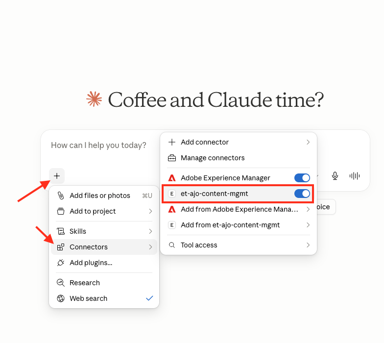

# AJO Content MCP Server — Quickstart

Run the **AJO Content MCP Server** from its pre-built container image — no source code, no build. This folder contains everything you need: this guide and a `docker-compose.yml`.

> **This is the abridged run guide.** For the project overview, the full tool catalog, personalization guidance, security model, and troubleshooting, see the **[main repository README](https://github.com/etrakselis/ajo-content-management-mcp-server/blob/main/README.md)**.

---

## What you need first

1. **Git**, to download this folder. Check if it's already installed by running `git --version` in a terminal. If not:
   - **macOS:** install [Xcode Command Line Tools](https://developer.apple.com/xcode/resources/) by running `xcode-select --install`, or install [Git directly](https://git-scm.com/download/mac).
   - **Windows:** download and install [Git for Windows](https://git-scm.com/download/win), which includes Git Bash.
2. **Docker Desktop**, installed and running (the whale icon shows "Docker Desktop is running"). Download: [docker.com/products/docker-desktop](https://www.docker.com/products/docker-desktop/).
3. **An Adobe API credentials file** (a Postman-environment JSON export from the Adobe Developer Console). Obtaining it requires admin access to the Adobe Developer Console and AJO — the **[full setup steps are in the main README](https://github.com/etrakselis/ajo-content-management-mcp-server/blob/main/README.md#prerequisites)**. You upload this file in Step 2 below.

---

## Steps

> **Prefer video?** This walkthrough covers steps 0–2 (cloning this folder, starting the server, and configuring it in the browser):
>
> <a href="https://youtu.be/H2uo5Rg36hM"></a>

## 0. Get this folder

If you haven't already, clone the repository and navigate into the distribution folder.

**macOS** (Terminal):
```bash
git clone --depth 1 --filter=blob:none --sparse https://github.com/etrakselis/ajo-content-management-mcp-server.git && cd ajo-content-management-mcp-server && git sparse-checkout set distribution && cd distribution
```

**Windows** (Command Prompt or PowerShell):
```
git clone --depth 1 --filter=blob:none --sparse https://github.com/etrakselis/ajo-content-management-mcp-server.git
```
```
cd ajo-content-management-mcp-server
```
```
git sparse-checkout set distribution
```
```
cd distribution
```

---

## 1. Start the server

> **Make sure Docker Desktop is running first** — look for the whale icon in your menu bar (macOS) or system tray (Windows) showing "Docker Desktop is running." The command below will fail if the Docker engine isn't started.

From this folder (the one containing `docker-compose.yml`):

```bash
docker compose up -d
```

The first run **pulls** the multi-arch image automatically and starts it in the background. Docker selects the right build for your CPU (Apple Silicon or Intel/AMD).

Then open **http://localhost:3000**.

> **Can't reach the page?** The server binds to loopback only by design. If `localhost` doesn't resolve, try **http://127.0.0.1:3000**.

### Everyday commands

```bash
docker compose logs -f     # watch logs (Ctrl+C to stop watching)
```
```bash
docker compose pull        # fetch the latest published image
```
```bash
docker compose up -d       # start (or restart after a pull)
```
```bash
docker compose down        # stop and remove the container
```

> **Pin a version** for reproducibility: edit `docker-compose.yml` and replace `:latest` with a specific tag, e.g. `ghcr.io/etrakselis/ajo-content-mcp:1.0.0`.

> **Advanced — trim the tool list (`MCP_LEAN_MODE`).** Optional, and usually unnecessary for a single connection. If you run this server alongside **many** other MCP servers and your client starts picking the wrong tool, edit `docker-compose.yml`, uncomment the `# - MCP_LEAN_MODE=1` line, and run `docker compose up -d`. It merges the five read-only authoring-reference tools into a single `get_reference` tool (called with a `topic`) — identical content, fewer tools advertised. Leave it commented out otherwise.

---

## 2. Configure MCP Server (in the browser)

The setup UI reveals one step at a time:

1. **Upload** your Adobe credentials (environment) file.
2. **Select** the sandbox (auto-populated from your credentials).
3. **Set the access mode** — read-only (default) or read & write.
4. **Enter your email** and click **Start MCP Server**.

Details for each step are in the **[MCP Server Configuration section of the main README](https://github.com/etrakselis/ajo-content-management-mcp-server/blob/main/README.md#mcp-server-configuration)**.

---

## 3. Connect your LLM client

### Claude Desktop

**1. Install [Node.js](https://nodejs.org/en/download)** if you don't have it, then verify:
```bash
npx --version
```

**2. Open your Claude Desktop config file.** Navigate to its folder using the command for your OS:

**macOS** (Terminal):
```bash
cd ~/Library/Application\ Support/Claude
```

**Windows** (Command Prompt):
```
cd %APPDATA%\Claude
```
**Windows** (PowerShell):
```
cd $env:APPDATA\Claude
```

**3. Add the server entry to `claude_desktop_config.json`, save the file, then restart Claude Desktop.**

If the file is empty or new:
```json
{
  "mcpServers": {
    "et-ajo-content-mgmt": {
      "command": "npx",
      "args": [
        "-y",
        "mcp-remote@latest",
        "http://localhost:3000/mcp"
      ]
    }
  }
}
```

If the file already has other servers or settings, add the new entry inside the existing `mcpServers` block:
```json
{
  "mcpServers": {
    "some-other-server": {
      "command": "...",
      "args": ["..."]
    },
    "et-ajo-content-mgmt": {
      "command": "npx",
      "args": [
        "-y",
        "mcp-remote@latest",
        "http://localhost:3000/mcp"
      ]
    }
  },
  "preferences": {
    "...": "..."
  }
}
```

> **`npx` not found?** Install Node via the official `.pkg` (macOS) / `.msi` (Windows) installer, or set the absolute path: find it with `which npx` (macOS) / `where npx` (Windows) and use e.g. `"command": "/usr/local/bin/npx"`.

### Verify the connection

After restarting Claude Desktop, open the connectors dropdown — you should see **et-ajo-content-mgmt** listed as a connected server:

<a href="../readme_images/claude-connector-example.png"></a>

For other clients (Claude Code, Cursor, Codex), see the **[Client Connection Guide](https://github.com/etrakselis/ajo-content-management-mcp-server/blob/main/README.md#client-connection-guide)**.

---

## 4. Start authoring — starter prompts

Once your client is connected, talk to the server in plain language. Below are a few prompts to get going — hover over any prompt and click the **copy** icon in its top-right corner, then paste it into your client (or adapt it).

### Orient yourself first

```text
Call get_server_context and tell me which tenant and sandbox I'm on, who I'm acting as, and whether write access is enabled — then list the tools you have available, grouped by what they do.
```

### ⭐ Before building any AJO email — run this first

AJO email content has strict, non-obvious requirements (native Visual Email Designer HTML, real personalization paths, scenario-specific configuration) that live behind dedicated reference tools. The model will sometimes skip those tools and guess, which produces email that opens in **Compatibility mode** (drag-and-drop editing lost) or uses invented personalization. **Paste this at the start of any template or fragment build** so it consults them *before* planning:

```text
Before you plan or write anything for this AJO email, call these three tools first and base your entire plan on what they return — do not guess or use generic email HTML:
1. get_email_scenario_faq — triage which personalization scenarios this content involves, then ask me the clarifying questions it lists.
2. get_visual_designer_requirements — so the HTML stays in AJO's native Visual Email Designer format (never Compatibility mode).
3. get_personalization_guidance — to decide what to personalize and how.

For any personalization, discover the real XDM schema paths from this sandbox yourself (use the XDM schema tools / the discover-personalization-paths prompt) instead of asking me for them — only ask me which discovered field a value maps to when it's genuinely ambiguous. Never invent or guess paths.

Keep the output organized: file every template and fragment you create into a descriptive folder (reuse an existing one, or create one with create_folder) and apply relevant tags (reuse existing tags via list_tags, or add them with create_tag) so the assets are easy to find and govern — don't leave them untagged at the folder root.

Only after you've reviewed all three tools, discovered the schema paths, and asked me your clarifying questions should you propose a plan for the template build-out — including where you'll file the assets and which tags you'll apply. If you skip any of them, stop and start over.
```

> **Why this matters:** these reference tools are the guardrails that keep generated content valid and editable in AJO. Anchoring the model to them up front is far more reliable than correcting the output afterward.

### Everyday tasks

```text
Show me all the content templates in this sandbox, then summarize what each one is for.
```

```text
Create a new AJO email template for a summer-promo announcement. Remember to triage the scenario, confirm the Visual Designer format, and plan personalization before writing any markup.
```

---

## 5. Optional: reference AEM-hosted assets in AJO content

If you want the LLM to embed images stored in AEM (Adobe Experience Manager) into AJO content fragments or templates, you need to do three additional things.

### 5a. Upload your assets to an AJO/AEM folder

Before the LLM can reference an image, the image must already exist in AEM and be accessible from your AJO sandbox.

1. In AEM Assets (or via the AJO Assets picker), **create a dedicated folder** for the campaign or project — e.g. `summer-promo-2026`.
2. **Upload your image files** into that folder.

> Keep all assets for a given campaign in the same folder. This makes it easy to tell the LLM exactly where to look.

### 5b. Add the AEM MCP connector to Claude Desktop

The `et-ajo-content-mgmt` server handles AJO content, but it cannot browse AEM Assets on its own. You need the **Adobe Experience Manager** MCP connector running alongside it.

Unlike the AJO server, the AEM connector is cloud-hosted and available directly from Claude Desktop's built-in connector library — no JSON config editing required.

1. Open Claude Desktop and click the **connectors** icon to open the connector manager.
2. Browse or search the MCP server library for **Adobe Experience Manager**.
3. Select it and click **Connect** (you may be prompted to authenticate with your Adobe credentials).

Once connected, you should see both connectors active in the connectors dropdown:

<a href="../readme_images/claude-connector-aem-example.png"></a>

### 5c. Tell the LLM which folder to use

The LLM does not automatically know where your assets live. When you start a conversation that involves images, mention the folder name explicitly, for example:

> *"The assets for this campaign are in the AEM folder named **summer-promo-2026**. Please use images from that folder when building the email template."*

The LLM will then use the AEM connector to look up the available images in that folder and embed the correct asset URLs into the AJO content it creates.

---

Full documentation: **[github.com/etrakselis/ajo-content-management-mcp-server](https://github.com/etrakselis/ajo-content-management-mcp-server/blob/main/README.md)**
